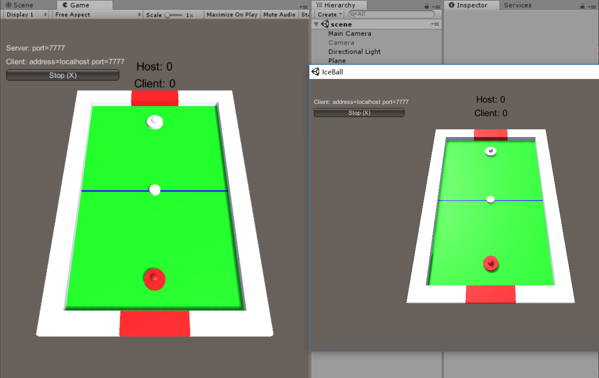
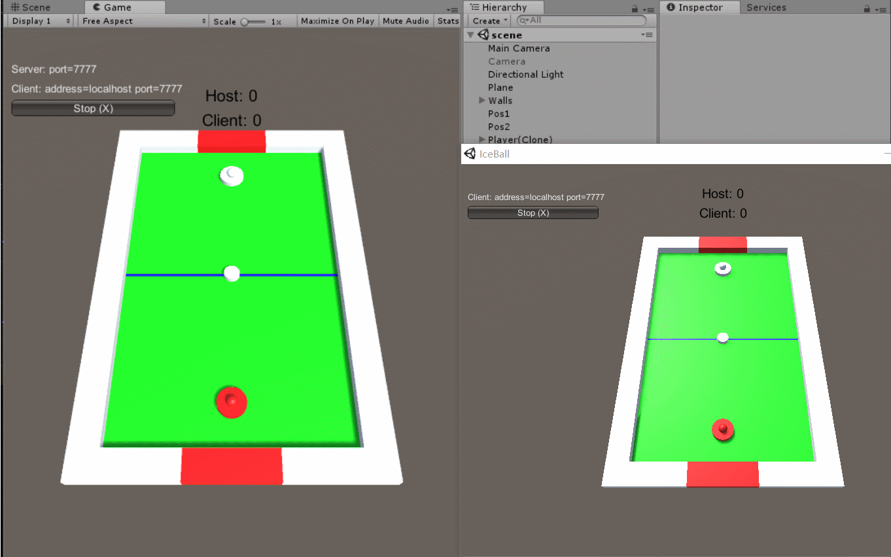
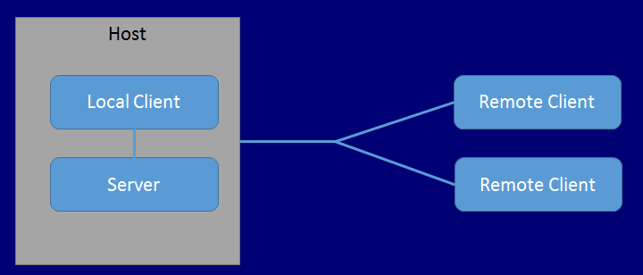
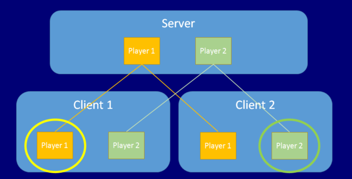
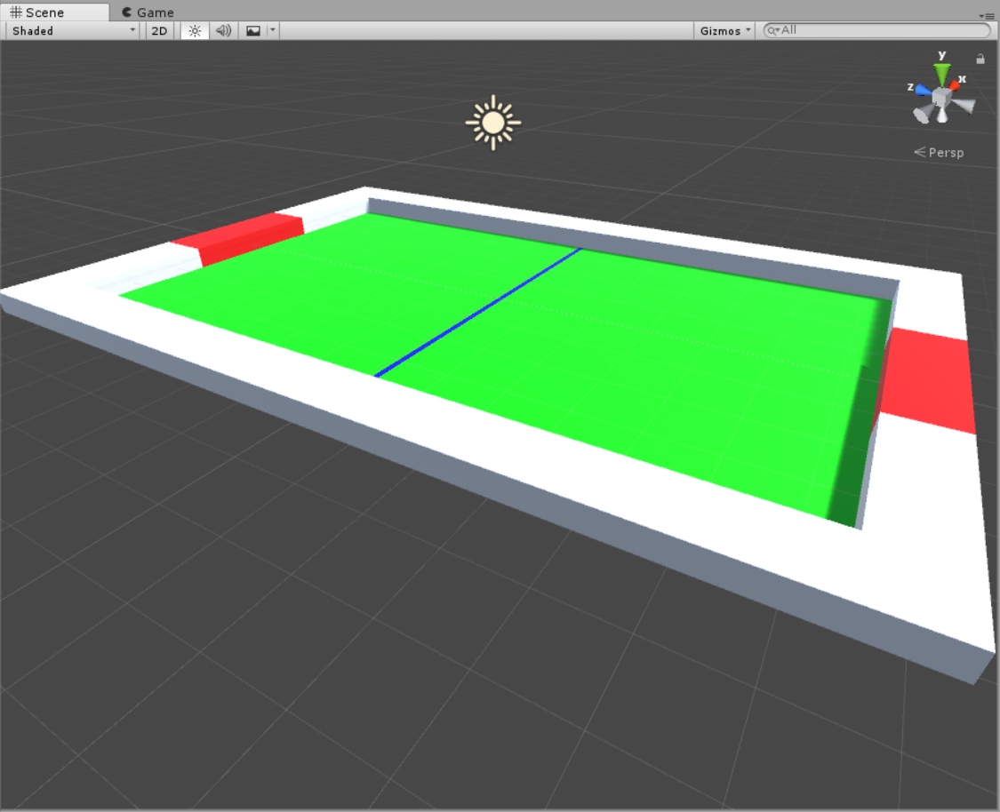

# Unity3d之联机冰球对战

---

## 1. 游戏简介
一个简单的联机冰球对战小游戏，双方可在自己的视角分别控制

## 2. 效果
- 静态图


- 动态图



---

## 3. 预备知识——Unity网络编程相关组件

### 3.1 浅谈个人对多人游戏与网络的一些看法
- 网络游戏可以说是目前最吸引各路游戏开发者的一大热点，尤其是多人游戏。因此，大多数游戏引擎及基本的开发语言都配有基本的成套的网络编程相关的功能或接口，如果一门开发语言或是游戏引擎不支持网络编程，那这个语言或是这类IDE肯定是走不远的。网络编程的运用在unity现在的游戏里面是必须的。完整的游戏都需要提供网络功能。
- 多人游戏与网络，相比单机的游戏，实现起来要复杂许多，但是可以实现更加丰富的功能。原理其实是很简单的，其实就是一个游戏的多个实例运行在不同的机器上，这些机器既可以是通过局域网互相连通，也可以是通过更广的网络连向世界各地。因此，要管理好这么多的实例，毫无疑问网络编程比较棘手的一个地方就是多个游戏实例之间的同步和通信，而一个实例里面就可能有成千上百的游戏对象，多人游戏更是可能涉及到上前上百万的游戏实例，这正是多人游戏与网络要解决的问题。
- unity里面比较常用的是unet，更底层、高端的还有像planton、socket之类，相较而言，unet就显得更加轻便和容易使用，是一个轻量级的好工具，也由于unet的轻便特性，更加适合开发局域网内的联机游戏，虽然在做高级开发时可能会遇到一些瓶颈（Unity自带的Networkview对于广域网就很难适应，这里就要转向socket一类更加底层的实现），但作为初学者学习网络编程是再好不过的选择了。

### 3.2 一些重要概念（引自 [这里](https://pmlpml.github.io/unity3d-learning/13-Multiplayer-and-Networking) ）
- 主机与服务器
    - HOST：主机，运行服务器程序的机器
    - Server：服务器，游戏程序实例。它连接所有客户端，并管理所有客户端共享的游戏对象及部分需要同步的状态（属性）
    - Client：客户端，游戏程序实例。玩家游戏主机运行的程序
    - 重要的关系图
    
- 游戏对象
    - **网络游戏对象（Networked GameObjects）** ：在服务器上注册，由孵化（也叫派生）系统（Spawning System）管理的对象，它必须包含 NetworkIdentity 组件，并用 NetworkBehaviour 脚本编程。
    - **玩家游戏对象（player GameObjects）** ：是特殊的网络游戏对象，指一个 client 加入网络游戏，服务器创建并孵化到客户端，由玩家控制的游戏对象。客户端代码可以控制它们的状态，并自动有服务器同步到其他玩家的客户端。例如：联网赛车游戏，每个玩家都有属于自己的赛车。
    - 关系图  
    

### 3.3 unet基本组件

- NetworkManager（核心）。作为多玩家游戏的核心控制组件。通常挂载在一个空的物体，或者一个方便的管理物体上。
    - Spawn Info属性集（重要）。最常用的一个组件属性，同时又由以下属性构成：
        - PlayerPrefab。客户端加入时自动生成的预制对象，可以预先定义好。
        - AutoCreatePlayer。勾选表示自动生成上面定义好的PlayerPrefab。
        - PlayerSpawnMethod。指定具体的生成方法：
            - Random。随机生成。
            - RoundRobin。轮询生成，适合用与对战游戏，在本次项目就采用这种生成方式，可以在指定的地点轮流生成（这里就要用到后面的NetworkStartPosition组件）
        - RegisteredSpawnablePrefabs。注册接下来需要派生的预制对象，比如一些枪战游戏，子弹就需要在各个客户端同步，需要派生到各个客户端。在本次项目中则是冰球，也需要由服务器派生到客户端。这是一个预制对象的数组，数组中的游戏对象可以在网络中同步生成。

- NetworkManagerHUD。一个基础的网络连接UI面板，适合用于简单的应用界面或者最初的开发调试界面（一般后期会被替换成更美观的UI）。所起的作用主要提供现成接口帮助实现前期的开发任务。

- NetworkIdentity。将一个预制对象标识为网络中的对象及扮演的角色。
    - ServerOnly。勾选表示该对象只在服务器端生成和存在。
    - LocalPlayerAuthority。勾选表示该对象可以在各个客户端中生成和存在，并由拥有它的客户端控制的，在对应客户端具有特定的权限，可以通过isLocalPlayer来识别。

- NetworkTransform。用于同步挂载了该组件的派生对象。
    - NetworkSendRate（seconds）。同步的频率。0代表在生成是同步一次
    - TransformSyncMode。指定要被同步的组件。一般默认第二个，具有刚体数属性的预制会自动默认为后两个（根据刚体组件是2d还是3d决定）
        - SyncNone。不同步其他组件
        - SyncTransform。同步Transform组件。
        - SyncRigidbody2D。同步Rigidbody2D组件。
        - SyncRigidbody3D。同步Rigidbody3D组件。

- NetworkStartPosition（很有用，也是很必要的一个组件）。指定预制对象的初始位置（可以不同）。因为实际情况往往就很需要多个客户端的玩家对象初始在不同位置，如本项目的两个玩家必须在两对面，不用这个组件就很麻烦，会导致玩家对象都生成在同一个位置。

- 基本标识
    - 游戏对象判断
        - IsClient。如果是正在运行的客户端对象，且是从服务器派生的，则为true。
        - IsLocalPlayer。如果是当前客户端的本地游戏对象（本地玩家——自己），则为true。
        - IsServer。如果这个对象是激活状态，且在一个被激活的服务器上，则为true。
    - 函数、变量判断
        - [Command]。用来标识只能在服务端被调用的方法，这些方法名都必须以Cmd开头，且不能是静态方法，否则会导致编译错误。常用于比如联网发射子弹，状态同步只能通过服务器来同步，再派生到各个客户端，因此发射子弹需要由客户端调用服务端上的发射方法，即被[Command]标记的方法。如果该方法用[Command]标记而是任由客户端自己调用的话，在各个客户端之间子弹就是各飞各的，一个客户端射出的子弹不会被另外一个客户端感知。
        - [ClientRpc]。用来表示只能在客户端被调用的方法，服务器调用该方法时，也会在客户端调用。被标识的方法必须以Rpc开头。
        - [SyncVar]。用来标识需要同步的变量，可以将被标识的变量同步到所有的客户端和服务器端。作用也是非常大，再拿对战游戏来说，需要同步各个客户端之间的具有不同值的血条，这时就必须将这些记录血量的变量标识为同步变量，否则各个客户端上的变量都是互不相关。

---

华丽的分割线——说了那么多，终于可以开始讲实现步骤了，多图预警。步骤有些繁琐（如仿作切勿遗漏），毕竟想实现这个游戏也是我一时脑洞兴起。

---

## 4. 实现步骤

### 4.1 网络管理对象设置
经过以下几步，应该就有了一个空的游戏管理对象，包含了基本的网络控制器和用户控制界面。这些组件的所以属性都还是默认设置。
- 创建一个空对象。
- 为其添加一个NetworkManager组件。
- 为其添加一个NetworkManagerHUD组件。

### 4.2 设置玩家对象预制
经过以下几步，应该就有了一个具有基本需要的网络玩家对象预制，其他代码脚本之后再添加。
- 创建一个圆柱体。
- 创建一个球体，作为圆柱体的子对象。
- 适当调整两者参数，使得两者组合看起来像一个冰球对战的手柄（就是手抓的那个，具体名字不知道叫什么）
- 添加NetworkIdentity组件。由前面的预备知识可知，我们需要在客户端和服务端中对玩家对象进行区分。
- 添加NetwTransform组件。因为玩家对象的移动需要在多个客户端之间同步。
- 添加Rigidbody刚体组件。点开Constraints属性集，对玩家预制进行一些约束。我们的玩家对象是需要紧贴在游戏台（桌面）上移动的，因此我们冻结其与等下要制作的游戏台（桌面）所在平面垂直的轴，我的桌面是平放的，因此我冻结了它的y轴，也就是防止它在碰撞过程中飞起来。同样，还要防止它在碰撞中产生旋转（假设我们的握力无穷大，现实中我们玩这个也是不会让手柄转起来的），所以干脆把旋转的三个轴都冻结了。综上，冻结了位置的y轴，旋转的所有轴。
- 拖入project面板做成预制。

### 4.3 玩家预制的移动
添加一个PlayerMove脚本，这里我直接把完整代码贴出来了，注释写得比较详细，结合前面的预备知识看。这个脚本我实现的功能主要是：
- 对玩家对象移动的控制。这里我实现了键盘移动和鼠标拖拽的功能，大量的代码其实用来判断边界条件了，主要是为了防止玩家对象移出界。注意这里不再是使用MonoBehaviour，而是NetworkBehaviour，需要引入UnityEngine.Networking;命名空间。
- 识别本地玩家对象。我们需要对玩家对象进行区分，这里通过前面提到的IsLocalPlayer来区分本地玩家对象和非本地玩家对象——自己和对手，**不区分的话会导致两个玩家对象同时被操控**。我用了红色来标记本地玩家对象，方便辨认。
- 冰球的创建（这个在后面会详细说，这里简要提一下）。OnStartLocalPlayer是一个在本地玩家对象创建的时候会被调用的方法，在这个方法里面我生成了唯一（看起来是一个，但是服务器在不同客户端各派生了一个）的冰球，防止重复创建。
- **摄像机角度的问题**。只要是对战游戏，就会涉及到用户角度的问题，如何让两个玩家看起来都是自己控制的对象靠近自己这边。这个问题困扰了我很久，由于摄像机不是玩家对象，没法像初始化玩家对象位置时用NetworkTransform来指定不同的初始位置。**最后，我想到了用两个摄像机，分别预先留在场景中，预先调好针对两个玩家的角度，然后在本地玩家创建时，将对方的摄像机灭活，这样就保证了每个玩家端都只有一个摄像机，且都是自己的角度。**
- **由摄像机角度问题带来的移动问题**。因为调整针对不同玩家的摄像机的时候，有个摄像机是翻转过来的，因此对于这个摄像机所活跃在的客户端，对玩家的运动需要反过来控制，也即是对x和z取个反。
```csharp
using System.Collections;
using System.Collections.Generic;
using UnityEngine;
using UnityEngine.Networking;

public class PlayerMove : NetworkBehaviour
{
    public GameObject ballPrefab;
    private Vector3 screenPoint;
    private Vector3 offset;
    private Vector3 scanPos;

    // Use this for initialization
    void Start () {
        scanPos = transform.position;
    }
	
	// Update is called once per frame
	void Update () {
        if (!isLocalPlayer)
            return;

        var x = Input.GetAxis("Horizontal") * 0.1f;
        var z = Input.GetAxis("Vertical") * 0.1f;

        //判断是哪边的玩家
        if (transform.position.z < 0)
        {
            //向前不能越过中线，向后不能超出边界
            if (transform.position.z + z < 0 && transform.position.z + z > -6)
            {                
                transform.Translate(0, 0, z);
            }      
            //向左向右都不能超出边界
            if (transform.position.x + x < 3.5 && transform.position.x + x > -3.5)
            {
                transform.Translate(x, 0, 0);
            }
        }
        else
        {
            //向前不能越过中线，向后不能超出边界
            if (transform.position.z - z > 0 && transform.position.z - z < 6)
            {
                transform.Translate(0, 0, -z);
            }
            //向左向右都不能超出边界
            if (transform.position.x - x < 3.5 && transform.position.x - x > -3.5)
            {
                transform.Translate(-x, 0, 0);
            }
        }

    }

    void OnMouseDown()
    {
        screenPoint = Camera.main.WorldToScreenPoint(scanPos);
        offset = scanPos - Camera.main.ScreenToWorldPoint(new Vector3(Input.mousePosition.x, Input.mousePosition.y, screenPoint.z));
    }

    void OnMouseDrag()
    {
        if (!isLocalPlayer)
            return;
        
        Vector3 curScreenPoint = new Vector3(Input.mousePosition.x, Input.mousePosition.y, screenPoint.z);
        Vector3 curPosition = Camera.main.ScreenToWorldPoint(curScreenPoint) + offset;

        var temp = transform.position;
        //判断是哪边的玩家
        if (transform.position.z < 0)
        {
            //向前不能越过中线，向后不能超出边界
            if (curPosition.z < -0.5 && curPosition.z > -6)
            {
                temp.z = curPosition.z;
                transform.position = temp;
            }
            //向左向右都不能超出边界
            if (curPosition.x < 3.5 && curPosition.x > -3.5)
            {
                temp.x = curPosition.x;
                transform.position = temp;
            }
        }
        else
        {
            //向前不能越过中线，向后不能超出边界
            if (curPosition.z > 0.5 && curPosition.z < 6)
            {
                temp.z = -curPosition.z;
                transform.position = temp;
            }
            //向左向右都不能超出边界
            if (curPosition.x < 3.5 && curPosition.x > -3.5)
            {
                temp.x = -curPosition.x;
                transform.position = temp;
            }
        }
        Debug.Log("curPosition" + curPosition);
    }

    public override void OnStartLocalPlayer()
    {
        //创建冰球，且唯一
        if (GameObject.Find("Ball(Clone)") == null)
            CmdStart();

        //取消对方的摄像机
        if (transform.position.z < 0)
        {
            GameObject.Find("Camera").SetActive(false);
        }

        //设置己方颜色
        MeshRenderer[] temp = GetComponentsInChildren<MeshRenderer>();
        foreach (MeshRenderer m in temp)
        {
            m.material.color = Color.red;
        }
    }    

    [Command]
    void CmdStart()
    {
        // This [Command] code is run on the server!

        // create the bullet object locally
        var ball = (GameObject)Instantiate(
             ballPrefab,
             new Vector3(0, 0.002f, 0),
             Quaternion.identity);

        // spawn the bullet on the clients
        NetworkServer.Spawn(ball);        
    }    
}
```

### 4.4 注册联网玩家对象
到上一步为止，玩家对象应该算是大功告成了。这里就要将玩家对象注册到网络管理器中（也就是第一步做的那个空对象）。
- 找到最开始创建的那个空对象，并展开NetworkManager组件。
- 找到Spawn Info属性集（默认被折叠），总之——展开。
- 找到 “Player Prefab” 插槽，拖入我们前面做好的玩家对象预制。
- 保存当前场景为scene（待会Build的时候需要添加现有场景）。

### 4.5 玩家对象初始化不同位置
在前面的基础上，如果只用代码无论如何调节都会导致两个玩家对象初始化在同一个位置。玩家应该在不同的地点。NetworkStartPosition 组件可用于执行此操作。
- 创建一个新的空对象 Pos1
- 添加 NetworkStartPosition 组件
- 将Pos1对象设置成其中一个玩家要被初始化的位置
- 创建第二个空对象 Pos2
- 添加 NetworkStartPosition 组件
- 将Pos1对象设置成另一个玩家要被初始化的位置
- 找到 NetworkManager 并选择它。
- 打开 “Spawn Info” 折页
- 将 Player Spawn Method 更改为 Round Robin。前面有提到这是轮询生成玩家对象。

### 4.6 冰球对象预制
冰球其实就是一个普通的圆柱体，但是要加一些关键的组件和脚本，见步骤。
- 创建一个圆柱体，调参成所要的样子，比玩家对象直径略小即可。
- 添加NetworkIdentity组件。由前面的预备知识可知，我们需要在客户端和服务端中对玩家对象进行区分。
- 添加NetwTransform组件。因为玩家对象的移动需要在多个客户端之间同步。
- 添加Rigidbody刚体组件。点开Constraints属性集，对玩家预制进行一些约束。我们的玩家对象是需要紧贴在游戏台（桌面）上移动的，因此我们冻结其与等下要制作的游戏台（桌面）所在平面垂直的轴，我的桌面是平放的，因此我冻结了它的y轴，也就是防止它在碰撞过程中飞起来。同样，还要防止它在碰撞中产生旋转（假设我们的握力无穷大，现实中我们玩这个也是不会让手柄转起来的），所以干脆把旋转的三个轴都冻结了。综上，冻结了位置的y轴，旋转的所有轴。
- 拖入project面板做成预制。
- 在PlayerMove脚本组件上，找到 ballPrefab 插槽
- 将冰球预制件拖入 ballPrefab 插槽

### 4.7 冰球移动及碰撞脚本
这部分实现冰球的主要代码。主要包括基本的移动边界判断，以及碰撞的检测和响应。代码注释挺详细，就不多做解释了。
```csharp
using System.Collections;
using System.Collections.Generic;
using UnityEngine;

public class Ball : MonoBehaviour {
	
    // Use this for initialization
	void Start () {

	}
	
	// Update is called once per frame
	void Update () {
        var speed = GetComponent<Rigidbody>().velocity;
        //Debug.Log("speed: " + speed);        

        //如果没有碰到上下边界，操作待扩展
        if (transform.position.z > -6 && transform.position.z < 6)
        {
            //transform.Translate(new Vector3(0, 0, speed.z));            
        }
        //碰到上下边界
        else
        {
            //碰到门，更改比分，重置球位置
            if (transform.position.x > -1.5 && transform.position.x < 1.5)
            {
                var score = GetComponent<Score>();
                Debug.Log(score);
                
                if (transform.position.z > 0)
                    score.HostWin();
                else score.ClientWin();

                transform.position = Vector3.zero;
                GetComponent<Rigidbody>().velocity = Vector3.zero;
            }
            //z轴速度反向
            else
            {
                speed.z = -speed.z;
                GetComponent<Rigidbody>().velocity = speed;
                Debug.Log("up down bound speed: " + speed);
            }            
        }
        
        //如果没有碰到左右边界，操作待扩展
        if (transform.position.x > -3.5 && transform.position.x < 3.5)
        {
            //transform.Translate(new Vector3(speed.x, 0, 0));
        }
        //碰到左右边界，x轴速度反向
        else
        {
            speed.x = -speed.x;
            GetComponent<Rigidbody>().velocity = speed;
            Debug.Log("left right bound speed:" + speed);
        }

        //速度衰减
        //speed *= 0.999f;
        //GetComponent<Rigidbody>().velocity = speed;
    }

    void OnCollisionEnter(Collision collision)
    {
        var hit = collision.gameObject;
        var hitPlayer = hit.GetComponent<PlayerMove>();

        if (hitPlayer != null)
        {
            var ballRigid = GetComponent<Rigidbody>();
            Debug.Log("velocity: " + ballRigid.velocity);
            //适当加速
            //ballRigid.velocity *= 2;
        }
    }
}
```

### 4.8 注册联网冰球对象
这一步是要将冰球的预制声明为网络预制对象，以便服务器可以派生创建。
- 选择 NetworkManager 并打开 “Spawn Info” 折叠
- 用 Add 按钮添加一个新的 spawn 预制件
- 将 Ball 预制件拖入新的 spawn 预制插槽

### 4.9 自己手动制作场景
前面说了这么多场景，不如先来做一下场景。这个场景做法因人而异，因为场景也比较简单，所以自己手动搭了一个，当然调参数还是非常繁琐的，要耐心点。这里我就说一下我的场景的架构。
- 架构一览图



- Plane就是桌面，没改名字，和Walls并列。
- Walls是旁边的墙（桌沿）的组合，为空对象。
    - Left。左边的墙，Cube。
    - Right。右边的墙，Cube。
    - Line。中间的分界线（把高度设成很小很小，并且去掉Collider，假装是二维），Cube，蓝色用材质加。
    - Bottom。下边界（下桌沿）对象的组合，空对象。下边界分为三部分组成。
        - Gate。球门，中间的红色部分，Cube，颜色用材质加。
        - Left。球门左边部分，Cube。
        - Right。球门右边部分，Cube。
    - Top。上边界（上桌沿）对象的组合，空对象。
        - Gate。球门，中间的红色部分，Cube，颜色用材质加。
        - Left。球门左边部分，Cube。
        - Right。球门右边部分，Cube。
- 参数都是精确计算过的，全都是刚好无缝衔接，这里就不一给出了。
- 给Plane添加Rigidbody刚体组件。并勾选Is Kinematic，去除运动学属性，以撑住其他物体，防止其他物体的重力导致下坠。
- 给Walls添加Rigidbody刚体组件。墙是需要碰撞的，但是墙不能移动，所以在Constraints里冻结所有位置轴和旋转轴。
- 近景效果图


### 4.10 玩家分数同步
这部分负责完成玩家分数状态的同步和相关的UI界面。
- 需要同步的变量。与对战胜负有关的变量是分数，这个分数既可以在场景中单独维护，由于这里有两个玩家，因此需要有两个分数变量，另外记录游戏状态也需要一个变量，这三个值都需要在网络中同步。这里我是挂载在冰球这个对象上，其实挂载一个空对象或者其他方便管理的对象都是可以的。
- 分数和游戏状态同步。这里要使用到的就是 [SyncVar] 标识，把一个变量标识为同步变量，也可以认为就是所有客户端共享的变量，因为这些被标记的变量都只能在服务端上修改，而所有客户端都可以通过访问服务端来获取变量。
- 服务端修改权限。这里用 IsServer 来限制权限，只允许服务端修改变量值。

- Score。以分数变量为主的共享数据类，包括一些基本的get/set方法以及对共享变量的修改方法。

```csharp
using System.Collections;
using System.Collections.Generic;
using UnityEngine;
using UnityEngine.Networking;

public class Score : NetworkBehaviour {

	// Use this for initialization
	void Start () {
		
	}
	
	// Update is called once per frame
	void Update () {
		
	}

    [SyncVar]
    public int score1 = 0;
    [SyncVar]
    public int score2 = 0;
    [SyncVar]
    public int game = 0; // status: 0=>playing; 1=>player1 win; 2=>player2 win;    

    public void HostWin()
    {
        //保证在服务端上修改共享变量
        if (!isServer)
            return;

        score1++;
        game = 1;
    }

    public void ClientWin()
    {
        //保证在服务端上修改共享变量
        if (!isServer)
            return;

        score2++;
        game = 2;
    }

    public int GetHostScore()
    {
        return score1;
    }

    public int GetClientScore()
    {
        return score2;
    }

    public void SetGameStatus(int status)
    {
        game = status;
    }

    public int GetGameStatus()
    {
        return game;
    }
}
```

- UserGUI。获取同步变量的值并以一定的UI界面呈现。

```csharp
using System.Collections;
using System.Collections.Generic;
using UnityEngine;

public class UserGUI : MonoBehaviour
{
    GUIStyle LabelStyle1;
    GUIStyle LabelStyle2;
    GUIStyle ButtonStyle;
    Score score;

    // Use this for initialization
    void Awake()
    {
        score = GetComponent<Score>();
        Debug.Log(score);        

        LabelStyle1 = new GUIStyle();
        LabelStyle1.fontSize = 20;
        LabelStyle1.alignment = TextAnchor.MiddleCenter;

        LabelStyle2 = new GUIStyle();
        LabelStyle2.fontSize = 30;
        LabelStyle2.alignment = TextAnchor.MiddleCenter;

        ButtonStyle = new GUIStyle("Button");
        ButtonStyle.fontSize = 20;
    }

    void Update()
    {

    }

    public void Continue()
    {
        score.SetGameStatus(0);
    }

    void OnGUI()
    {
        if (score != null)
        {
            //playing
            GUI.Label(new Rect(Screen.width / 2 - 50, Screen.height / 2 - 280, 100, 50), "Host: " + score.GetHostScore(), LabelStyle1);
            GUI.Label(new Rect(Screen.width / 2 - 50, Screen.height / 2 - 250, 100, 50), "Client: " + score.GetClientScore(), LabelStyle1);

            if (score.GetGameStatus() == 1) // host win
            {
                GUI.Label(new Rect(Screen.width / 2 - 50, Screen.height / 2 - 85, 100, 50), "Host win!", LabelStyle2);
                if (GUI.Button(new Rect(Screen.width / 2 - 70, Screen.height / 2, 140, 70), "Continue", ButtonStyle))
                {
                    Continue();
                }
            }
            else if (score.GetGameStatus() == 2) // client win
            {
                GUI.Label(new Rect(Screen.width / 2 - 50, Screen.height / 2 - 85, 100, 50), "Client win!", LabelStyle2);
                if (GUI.Button(new Rect(Screen.width / 2 - 70, Screen.height / 2, 140, 70), "Continue", ButtonStyle))
                {
                    Continue();
                }
            }
        }        
    }
}
```

### 4.11 运行！
完成前面的所有步骤后，便是创建客户端了，实现客户端和服务端联机。
- 使用菜单 File -> Build Settings 打开 Build Settings 对话框。
- 按下 Add Open Scenes 按钮，将当前场景添加到版本
- 按 Build and Run 按钮创建构建。保存可执行文件为IceBall。
- 编译后的独立程序将启动，并显示分辨率选择对话框。
- 选择 windowed 复选框和较低的分辨率（为保持良好的流畅性），如800x600。
- 运行并连接（两个应用只要是一个当主机，一个当客户机即可）
    - 点击Play按钮，程序将启动并显示 NetworkManager HUD 的UI界面。
    - 从 NetworkManagerHUD 用户界面中，选择 LAN HOSTED 作为局域网主机启动。
    - 切换回编辑器，点击运行按钮进入运行模式。
    - 从 NetworkManagerHUD 用户界面中，选择 LAN Client 作为客户端连接到主机
- 这时会发现就出现最开始的界面了


--- 

## 5. 其他
在学了将近一个学期的3d游戏编程后，终于来到了令人激动的网络编程模块。通过本次实战，对unity中的网络编程乃至对整个网络游戏的开发流程有了一个相对清晰了思路，对网络编程的原理和机制也有了更深的了解。虽然可能实现起来一开始会摸不着头脑，但随着对网络编程由浅入深的了解，就能慢慢体会到网络编程的乐趣所在了，而且学会网络编程这一套思想，不止是unity开发，像是web，java，cocos的开发都是通吃的。

---

## 6. 各种链接

- b站视频地址

[https://www.bilibili.com/video/av25456530/](https://www.bilibili.com/video/av25456530/)

- Github地址  

[https://github.com/gitgiter/unity3d-learning/tree/master/homework9](https://github.com/gitgiter/unity3d-learning/tree/master/homework9)

- Github博客地址

[]()

- CSDN博客地址

[]()