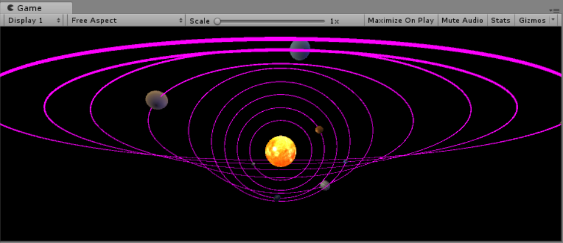
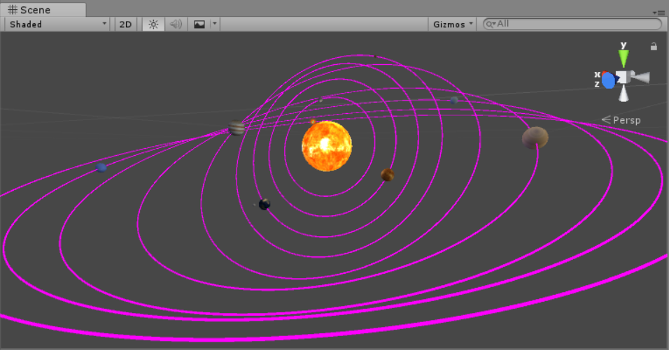
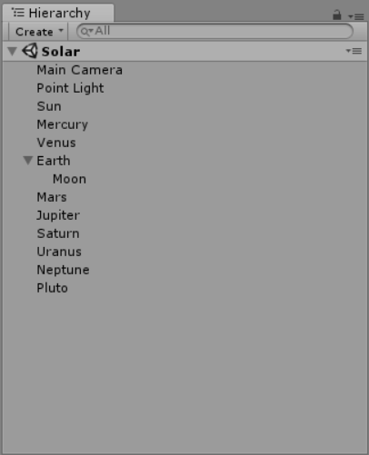

# 简答题
1. 游戏对象运动的本质是什么？
2. 请用三种方法以上方法，实现物体的抛物线运动。（如，修改Transform属性，使用向量Vector3的方法…）
3. 写一个程序，实现一个完整的太阳系， 其他星球围绕太阳的转速必须不一样，且不在一个法平面上。  

# 个人理解

1. 游戏对象运动的本质是游戏对象的位置的改变。
``` csharp
public class Uniform : MonoBehaviour {

    private GameObject MyCube;
    // Use this for initialization
    void Start () {
        MyCube = GameObject.Find("Cube");
    }
    
    // Update is called once per frame
    void Update () {      
        MyCube.transform.position += (float)0.1 * Vector3.left;
    }
}
```
2. 抛物线运动的三种实现
    - 修改Transform
    ``` csharp
    public class Parabola1 : MonoBehaviour {	

        private GameObject MySphere;
        private float vx;
        private float vz;
        private float a;
        private float t;
        // Use this for initialization
        void Start()
        {
            MySphere = GameObject.Find("Sphere");
            vx = (float)0.5;
            vz = 0;
            a = (float)0.1;
            t = Time.deltaTime;
        }

        // Update is called once per frame
        void Update()
        {
            float x = MySphere.transform.position.x;
            float y = MySphere.transform.position.y;
            float z = MySphere.transform.position.z;
            MySphere.transform.position = new Vector3(x + vx, y, z + vz);
            vz += a * t;
        }
    }
    ```  
    - 使用Vector3  
    ``` csharp
    public class Parabola2 : MonoBehaviour {

        private GameObject MyCapsule;
        private Vector3 vx;
        private Vector3 vz;
        private Vector3 a;
        private float t;
        // Use this for initialization
        void Start()
        {
            MyCapsule = GameObject.Find("Capsule");
            vx = (float)0.5 * Vector3.right;
            vz = Vector3.zero;
            a = (float)0.1 * Vector3.forward;
            t = Time.deltaTime;
        }

        // Update is called once per frame
        void Update()
        {
            MyCapsule.transform.position += vx;
            MyCapsule.transform.position += vz;
            vz += a * t;
        }
    }
    ```  
    - 使用Rigidbody  
    ``` csharp
    public class Parabola3 : MonoBehaviour {

        private Rigidbody rigid;
        private Vector3 v0;

        // Use this for initialization
        void Start()
        {
            rigid = this.GetComponent<Rigidbody>();
            v0 = new Vector3(3, 10, 0);
            rigid.velocity = v0;
        }

        // Update is called once per frame
        void Update()
        {

        }
    }
    ```
3. 具体实现见Solar.cs文件，以下部分是效果图和部分核心代码  
    - 材质  
    从网上下载各个行星对应的材质
    - 自转(以地球自转为例)
    ``` csharp
    Earth.Rotate(Vector3.up * 30 * Time.deltaTime);
    ```
    - 公转(以地球公转为例)
    ``` csharp
    Earth.RotateAround(Sun.position, axis3, 10 * Time.deltaTime);
    ```  
    月球绕地球转只需将绕点设成地球的position即可，有个地方要注意的是必须把月球放在地球的子对象中，否则会失去随地球绕太阳公转这一属性，显得有滞后性
    - 轨迹  
    添加一个Trail Render的组件记录行星移动轨迹
    - 轨道不同面  
    调整各个行星的公转轴使其不朝着一个方向即可
    - 自发光
        - 将太阳的材质设置成可发光类型
        - 在太阳的中心防止一个点光源
        - 修改背景以显示阴影效果
    - 效果图  
      
    
    - 对象结构  
    