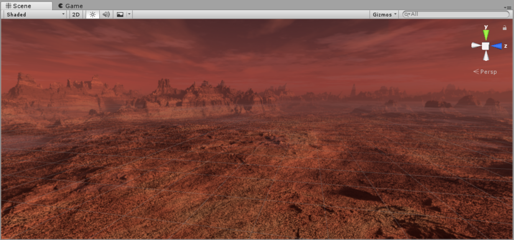
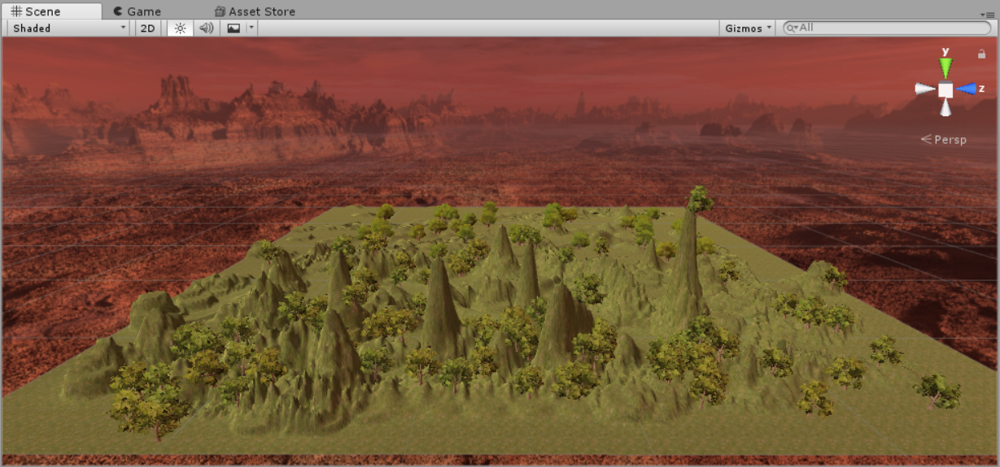
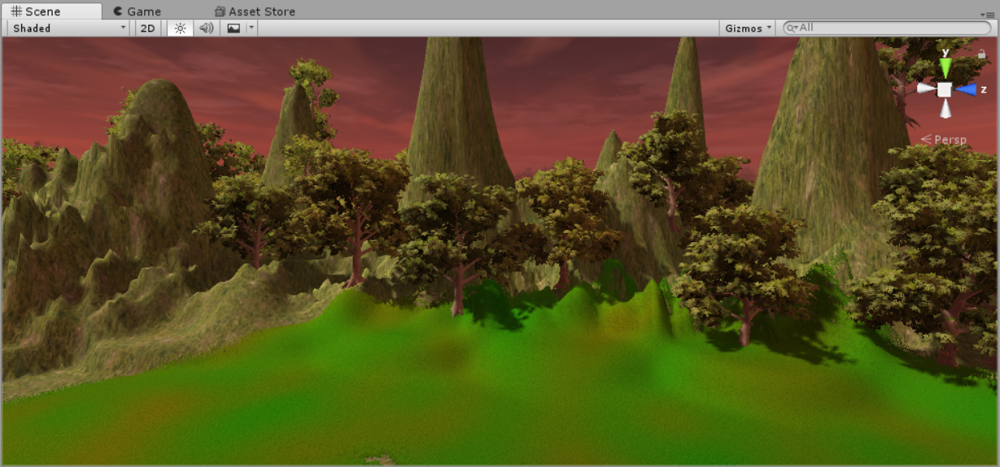
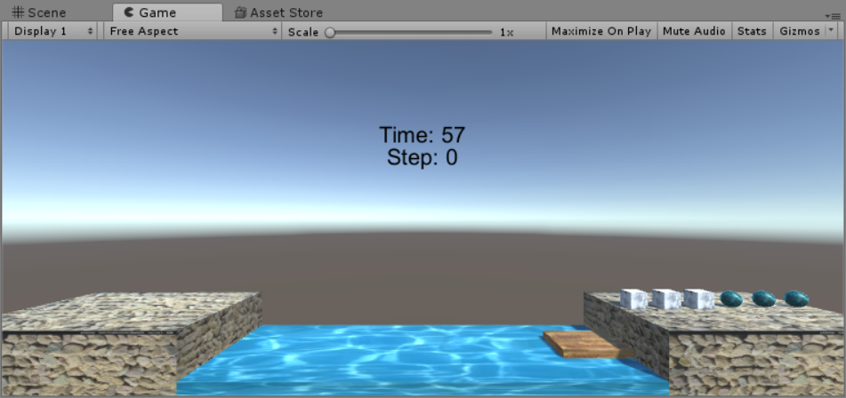
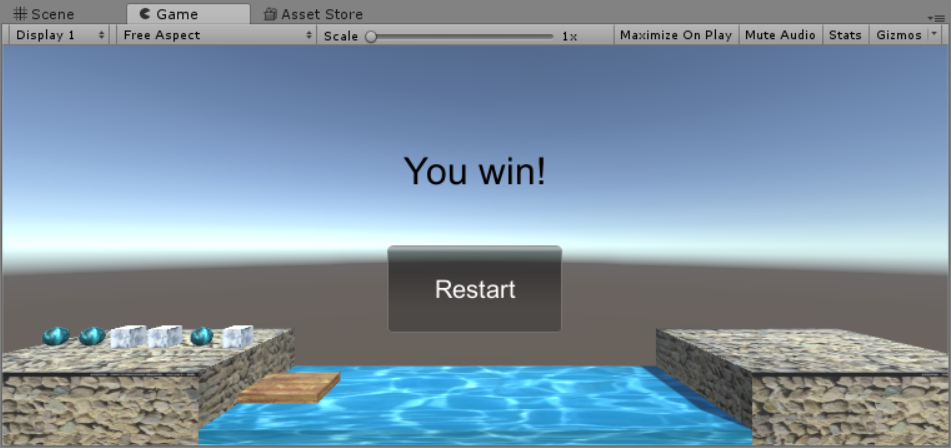
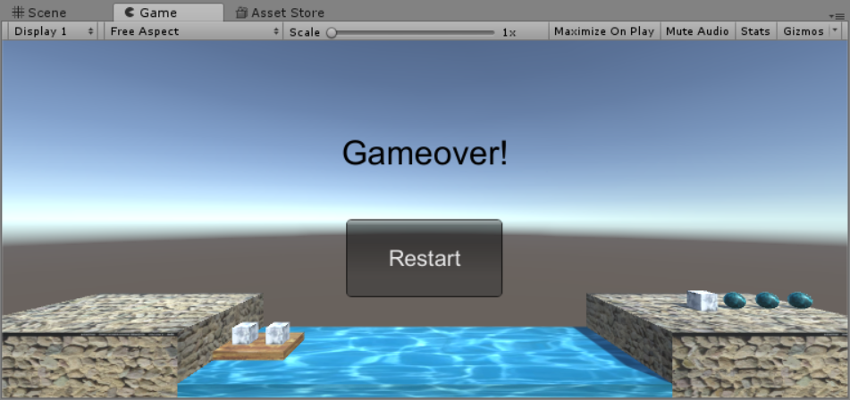
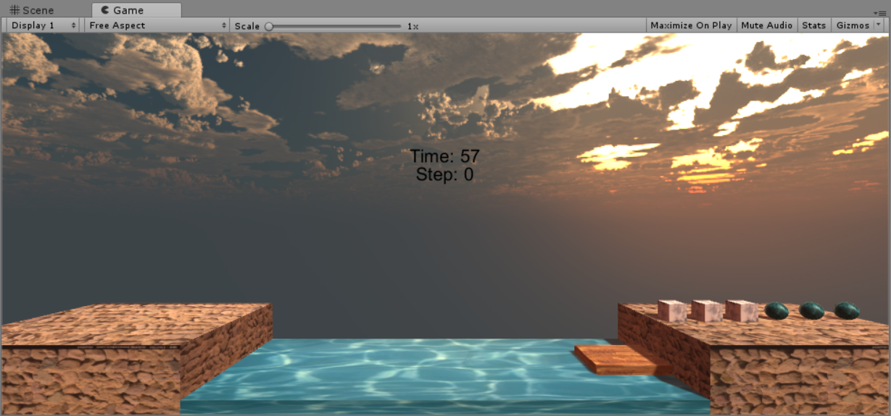
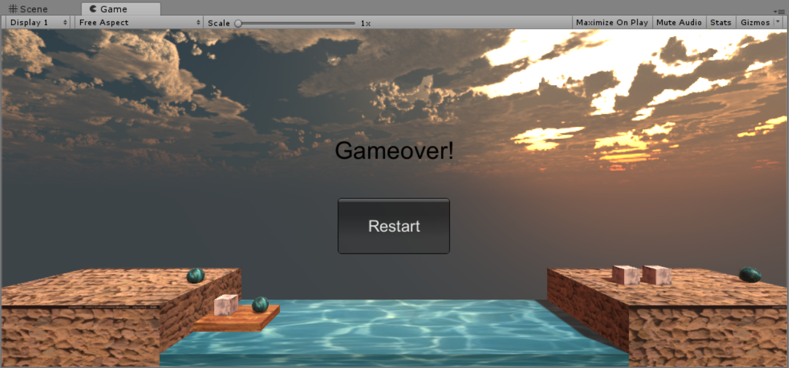
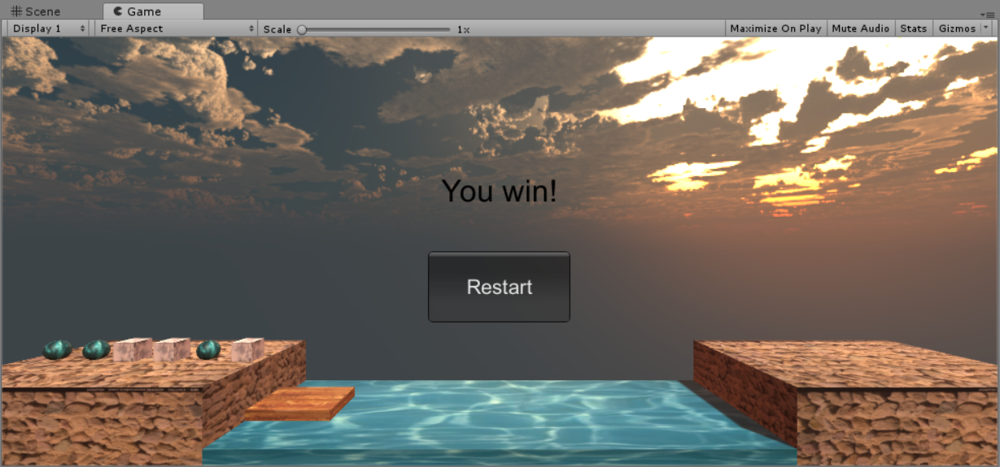

# 操作与总结
## 参考 Fantasy Skybox FREE 构建自己的游戏场景
- 首先要去Assets store里找到对应的资源下载，在搜索框输入Fantasy Skybox FREE有如下结果，选择第一个下载，然后import导入到项目资源中，便可以使用这个资源包了。
- Skybox顾名思义，天空盒，是用来模拟游戏场景中的天空效果的。由于scene和game的视角从某种意义上来说是固定的，所以要较好的模拟天空的效果，就需要把天空当成一个六面体的盒，在每个面上贴上对应的Texture，以此来模拟天空罩住游戏场景。
- 下图是用了天空盒构建的场景图

- 只有天空或许显得单调，我们可以再给它加个地形Terrain，地形的贴图以及后来的花草树木在新版本的unity里面是没有自带的，也需要自行到Assets store里面下载导入。
- 以下是最终的效果图(water environment还没来得及做)
  


## 写一个简单的总结，总结游戏对象的使用
- 游戏对象可以使用unity自带的正方体，圆柱体，球体等基础的资源构建
- 游戏对象也可以通过基础游戏对象组合构建之后做成预制，以便后来重复使用
- 游戏对象有许多属性，比较重要的有Transform属性，和纹理材质等
- 游戏对象可以添加许多组件，来实现不同的特定功能，使效果更加炫酷
- 游戏对象既可以在图形界面实例化，也可以通过代码实例化
- 游戏对象可以通过添加对应的脚本来实现不同的行为
- 等等
# 编程实践---牧师与魔鬼
- 本项目Github地址——[传送门](https://github.com/gitgiter/unity3d-learning/tree/master/homework3)
- 鉴于上次写的牧师与魔鬼v1版本没有来得及写博客，这次顺便补上,以下介绍从基础MVC版本到动作分离版的过渡
## 牧师与魔鬼v1——基础MVC架构版  
- MVC架构，简单来说目的是使代码分层，解耦，使每个类尽可能地行使单一的职责，以便于之后维护和扩展；另外，模块化的架构还可以使刚开始编程时尽可能少的考虑细节，使代码编写趋于简单。
> MVC架构定义：MVC全名是Model View Controller，是模型(model)－视图(view)－控制器(controller)的缩写，一种软件设计典范，用一种业务逻辑、数据、界面显示分离的方法组织代码，将业务逻辑聚集到一个部件里面，在改进和个性化定制界面及用户交互的同时，不需要重新编写业务逻辑。MVC被独特的发展起来用于映射传统的输入、处理和输出功能在一个逻辑的图形化用户界面的结构中。——百度百科
- 游戏规则：很经典的游戏，应该大家以前都玩过。游戏初始界面是三个牧师和三个魔鬼都在同一侧河岸，准备过河，但只有一条船且只能容纳两个对象，船必须至少有一个对象才能开动。游戏目的是采取合适的策略将全部牧师和魔鬼安全送到对岸，如果途中出现某一岸魔鬼多于牧师的情况，则游戏失败。
- 先贴一下此版本的效果图
    - 启动界面  
      
    - 胜利界面  
    
    - 失败界面  
      
- 本项目分离出来的MVC框架  
Model: Shore, Boat, Item  
View: UserGUI, ClickGUI
Controller: BoatControl, ShoreControl, ItemControl, FirstControl, Director
- 以下是各个类的简要作用，代码较多就不一一贴上来了，可前往Github查看具体代码
- Model——模型（可预制）
    - Shore：岸的实例    
    - Boat：船的实例
    - Item：对象(魔鬼或牧师)的实例
- View——视图
    - UserGUI
    用户交互界面
    - ClickGUI
    响应点击事件
- Controler——控制器
    - Director：导演，总指挥，单例模式
    ``` csharp
    public class Diretor : System.Object
    {
        private static Diretor _instance;
        public SceneControl sceneCtrl { get; set; }

        public static Diretor getInstance()
        {
            if (_instance == null) return _instance = new Diretor();
            else return _instance;
        }
    }
    ```
    - FirstControl：第一场景控制器，是唯一加到对象上的脚本
    - BoatControl：船的控制器，包括记录船上空余位置，船的属性和状态等
    - ShoreControl：岸的控制器，包括记录岸上空余位置，对象上岸离岸等
    - ItemControl：对象的控制器，包括对象的实例化，控制对象的移动
- 一些接口
    - SceneControl：负责整个场景的实例化
    ``` csharp
    public interface SceneControl
    {
        void LoadPrefabs();
    }
    ```
    - UserAction：控制动作
    ``` csharp
    public interface UserAction
    {
        void BoatMove();
        void Restart();
        void ItemClick(ItemControl itemCtrl);
    }
    ```
- 提一下主要的动作控制类——Moveable
``` csharp
    public class Moveable : MonoBehaviour
    {
        public float time = 3; //抛物时间
        public float g = -10; //重力加速度
        private Vector3 v0; //初速度
        private Vector3 Gravity; //由重力产生的垂直速度
        private float dTime = 0; //记录运动时间
        private float fixUpdateStep = 0.1f; //设置运动速度

        private static float speed = 20; //船的移速
        public int status; //运动状态
        Vector3 des; //终点
        
        void Update()
        {
            
            if (status == 1) // 实现对象抛物线运动
            {
                Gravity.y = g * (dTime += fixUpdateStep);
                transform.Translate(v0 * fixUpdateStep);
                transform.Translate(Gravity * fixUpdateStep);
                if (dTime >= time - fixUpdateStep)
                {
                    transform.position = des;
                    status = 0;
                    dTime = 0;
                }
            }
            else if (status == 2) // 实现船的直线运动
            {
                transform.position = Vector3.MoveTowards(transform.position, des, speed * fixUpdateStep);
                if (transform.position == des) status = 0;
            }
            
        }
        public void MoveTo(Vector3 target) // 设置运动的终点，并以此计算抛物线的初速度
        {
            des = target;
            status = 1;
            if (des.y == transform.position.y) status = 2;
            //Debug.Log("From:" + transform.position);
            v0 = new Vector3((des.x - transform.position.x) / time,
                (des.y - transform.position.y) / time - 0.5f * g * time, (des.z - transform.position.z) / time);
            Gravity = Vector3.zero;
            //Debug.Log("v0:" + v0);
            //Debug.Log("Target:" + target);                       
        }
        public void Reset()
        {
            status = 0;
            dTime = 0;
        }
    }
```
## 牧师与魔鬼v2——动作分离版
**最主要的改动——利用ActionManager的模板，实现Movable类的转移**  
这里不再介绍MVC，直接开始介绍动作分离。
- 先上效果图，改进了UI，现学现用加了一个天空盒  
  
  

- 添加的文件——Action，有关动作管理的类和实现全都转移到这个文件里，模板基本套用ppt上现成代码，略作修改
- 动作的分离，一下改动主要是将v1遗留的耦合动作剔除
    - FirstControl里的改动
    ``` csharp
    private ActionManager MyActionManager; // add in v2
    
    // Use this for initialization
	void Start () {
        Diretor diretor = Diretor.getInstance();
        diretor.sceneCtrl = this;
        itemCtrls = new ItemControl[6];
        LoadPrefabs();
        user = gameObject.AddComponent<UserGUI>();
        user.Restart();
        MyActionManager = gameObject.AddComponent<ActionManager>() as ActionManager; // add in v2
    }
    ```
    ``` csharp
    public void BoatMove()
    {
        Debug.Log("BoatMove");
        if (boat.IsEmpty()) return;
        //boat.Move();
        MyActionManager.MoveBoat(boat); // add in v2
        user.step++;
        user.status = Check();
    }
    public void ItemClick(ItemControl itemCtrl)
    {
        Debug.Log("ItemClick");
        if (itemCtrl.isOnBoat)
        {
            ShoreControl side;
            if (boat.status == 1) side = fromShore;
            else side = toShore;

            Debug.Log(side.GetEmptyPosition());
            boat.GetOffBoat(itemCtrl);
            //itemCtrl.MoveTo(side.GetEmptyPosition());
            MyActionManager.MoveItem(itemCtrl, side.GetEmptyPosition()); // add in v2
            itemCtrl.GetOnShore(side);
            side.GetOnShore(itemCtrl);
            user.step++;
        }
        else
        {
            if (boat.IsFull()) return;

            Debug.Log(itemCtrl.item.name + " getting on boat");
            ShoreControl side = itemCtrl.shoreCtrl;
            if (side.status != boat.status) return;

            side.GetOffShore(itemCtrl.item.name);
            //Debug.Log(MyActionManager);
            //Debug.Log(itemCtrl);
            //Debug.Log(boat);
            //itemCtrl.MoveTo(boat.GetOnBoat(itemCtrl));
            MyActionManager.MoveItem(itemCtrl, boat.GetOnBoat(itemCtrl)); // add in v2
            itemCtrl.GetOnBoat(boat);
            user.step++;
        }
        user.status = Check();
    }
    ```
    - BoatControl的改动
    ``` csharp
    public class BoatControl
    {
        public GameObject boat;
        //public Moveable moveable; // remove in v2
        public Vector3 from = new Vector3(10, 2, 0);
        public Vector3 to = new Vector3(-10, 2, 0);
        public Vector3[] froms;
        public Vector3[] tos;
        public int status; // from = 1, to = 0
        public ItemControl leftSeat;
        public ItemControl rightSeat;

        public static float speed = 50; // add in v2

        public BoatControl()
        {
            status = 1;
            leftSeat = null;
            rightSeat = null;

            froms = new Vector3[] { new Vector3(9, 3, 0), new Vector3(11, 3, 0) };
            tos = new Vector3[] { new Vector3(-11, 3, 0), new Vector3(-9, 3, 0) };

            boat = (GameObject)Object.Instantiate(Resources.Load("Prefabs/Boat", typeof(GameObject)), from, Quaternion.identity, null);           
            boat.name = "Boat";

            //moveable = boat.AddComponent(typeof(Moveable)) as Moveable; // remove in v2
            boat.AddComponent(typeof(ClickGUI)); // add click event
        }
        //public void Move() // remove in v2
        //{
        //    if (status == -1) moveable.MoveTo(from);
        //    else moveable.MoveTo(to);
        //    status = -status;
        //}
        public bool IsEmpty()
        {
            if (leftSeat == null && rightSeat == null) return true;
            else return false;
        }
        public bool IsFull()
        {
            if (leftSeat != null && rightSeat != null) return true;
            else return false;
        }
        public Vector3 GetOnBoat(ItemControl item)
        {
            if (leftSeat == null)
            {
                leftSeat = item;
                return status == -1 ? tos[0] : froms[0];
            }
            else if (rightSeat == null)
            {
                rightSeat = item;
                return status == -1 ? tos[1] : froms[1];
            }
            else return Vector3.zero;
        }
        public ItemControl GetOffBoat(ItemControl item)
        {
            // to decide which item to get off
            ItemControl temp = null;
            if (leftSeat == item)
            {
                temp = leftSeat;
                leftSeat = null;
            }
            else if (rightSeat == item)
            {
                temp = rightSeat;
                rightSeat = null;
            }
            return temp;
        }
        public int GetItemNum(int type) // get the num of item, priest or devil
        {
            int count = 0;
            if (leftSeat != null && leftSeat.itemType == type) count++;
            if (rightSeat != null && rightSeat.itemType == type) count++;
            return count;
        }
        public void Reset()
        {
            //moveable.Reset(); // remove in v2
            //if (status == -1) Move(); // remove in v2
            leftSeat = null;
            rightSeat = null;
        }
    }
    ```
    - ItemControl的改动
    ``` csharp
    public class ItemControl
    {
        public GameObject item { get; set; } // the instance
        public int itemType { get; set; } // the type of the item
        public ClickGUI clickGUI; // manage click event
        //public Moveable moveable; // remove in v2
        public bool isOnBoat;
        public ShoreControl shoreCtrl;

        public ItemControl(string type) //Instantiate
        {
            if (type == "Priest")
            {
                item = Object.Instantiate(Resources.Load("Prefabs/Priest", typeof(GameObject)), Vector3.zero, Quaternion.identity, null) as GameObject;
                itemType = 0;
            }
            else
            {
                item = Object.Instantiate(Resources.Load("Prefabs/Devil", typeof(GameObject)), Vector3.zero, Quaternion.identity, null) as GameObject;
                itemType = 1;
            }
            //moveable = item.AddComponent(typeof(Moveable)) as Moveable; // remove in v2

            clickGUI = item.AddComponent(typeof(ClickGUI)) as ClickGUI; // add click event
            clickGUI.itemCtrl = this;
        }
        //public void MoveTo(Vector3 des) // remove in v2
        //{
        //    moveable.MoveTo(des);
        //}
        public void GetOnBoat(BoatControl boatCtrl)
        {
            shoreCtrl = null;
            item.transform.parent = boatCtrl.boat.transform;
            isOnBoat = true;
        }
        public void GetOnShore(ShoreControl side)
        {
            shoreCtrl = side;
            item.transform.parent = null;
            isOnBoat = false;
        }
        public void Reset()
        {
            //moveable.Reset(); // remove in v2
            ShoreControl fromShore = ((FirstControl)Diretor.getInstance().sceneCtrl).fromShore;
            GetOnShore(fromShore);
            item.transform.position = fromShore.GetEmptyPosition();
            fromShore.GetOnShore(this);
        }
    }
    ```
- Moveable的转移  
这里简要提一下抛物线从Moveable转移到ActionManager的处理，原本在Movable里面是将抛物线分成一小段一小段的直线位移，利用固定帧的刷新来实现抛物线的曲线效果，但是因为Moveable既管理船的动作又管理对象的动作，就避免不了要用状态来区分到底是要执行谁的动作，这样看起来代码就不是很美观，可读性也有所下降。而在ActionManager中，虽然也是同时管理船的动作和对象的动作，但是却可以用**单运动**和**组合运动**来区分两者，单运动的处理就不用再赘述了，关于组合运动这里有个重要的方法就是SequenceAction，要知道把动作看成一小段一小段的直线运动的组合，就能实现几乎所有的曲线运动，也就是说，ActionManager完美解决了所有的曲线运动。在这里，虽然我也是将抛物线分成一小段一小段的直线运动，但并不是像Moveable里一样直接使用帧刷新来完成运动，而是通过将分段后的动作顺序放入一个Action的List中，交由SequenceAction来处理多个动作的连贯组合，就很好地避免了Moveable里面区分状态的尴尬局面。
``` csharp
public class ActionManager : SSActionManager
{   
    public void MoveBoat(BoatControl boatCtrl)
    {
        SSMoveToAction action;
        if (boatCtrl.status == -1) 
            action = SSMoveToAction.GetSSMoveToAction(boatCtrl.from, BoatControl.speed);
        else action = SSMoveToAction.GetSSMoveToAction(boatCtrl.to, BoatControl.speed);
        boatCtrl.status = -boatCtrl.status;
        AddAction(boatCtrl.boat, action, this);
    }

    public void MoveItem(ItemControl itemCtrl, Vector3 finalDes)
    {
        //Debug.Log("enter MoveItem!");
        float time = 3;
        float g = -10;
        Vector3 v0;
        float vy_ByGravity = 0;
        float stepTime = 0.1f;
        Vector3 currentDes = itemCtrl.item.transform.position;

        List<SSAction> divide = new List<SSAction>();

        // the des here is the final des
        v0 = new Vector3((finalDes.x - itemCtrl.item.transform.position.x) / time,
            (finalDes.y - itemCtrl.item.transform.position.y) / time - 0.5f * g * time, (finalDes.z - itemCtrl.item.transform.position.z) / time);
        //Debug.Log(v0);
        //Debug.Log(time / stepTime);


        // divide the curve to many parts
        for (int i = 0; i < time / stepTime - 1; i++)
        {
            //Debug.Log(divide[i]);
            //Debug.Log(currentDes);
            // change the vy
            vy_ByGravity += g * stepTime;
            // set current des
            currentDes += v0 * stepTime;
            currentDes.y += vy_ByGravity * stepTime;
            // get the current speed
            float currentSpeed = Mathf.Sqrt(v0.x * v0.x + (v0.y + vy_ByGravity) * (v0.y + vy_ByGravity));
            // add one of the movements
            SSAction temp = SSMoveToAction.GetSSMoveToAction(currentDes, currentSpeed * 10);
            divide.Add(temp);
        }
        SSAction seqAction = SequenceAction.GetSequenceAction(1, 0, divide);
        AddAction(itemCtrl.item, seqAction, this);
    }
}
```

