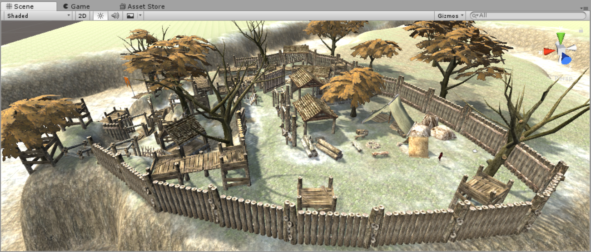
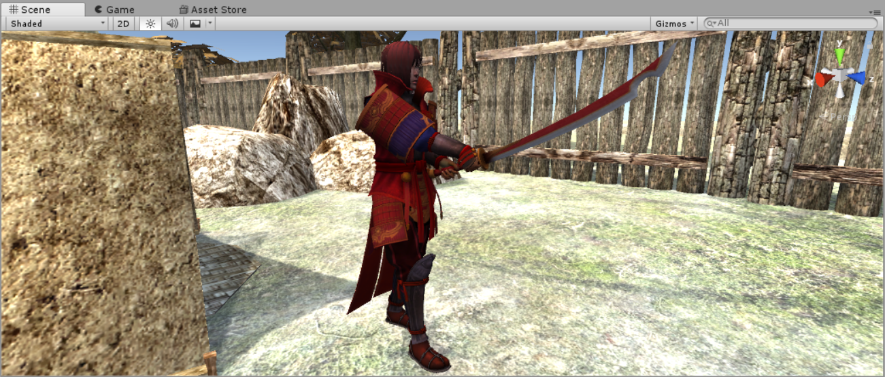
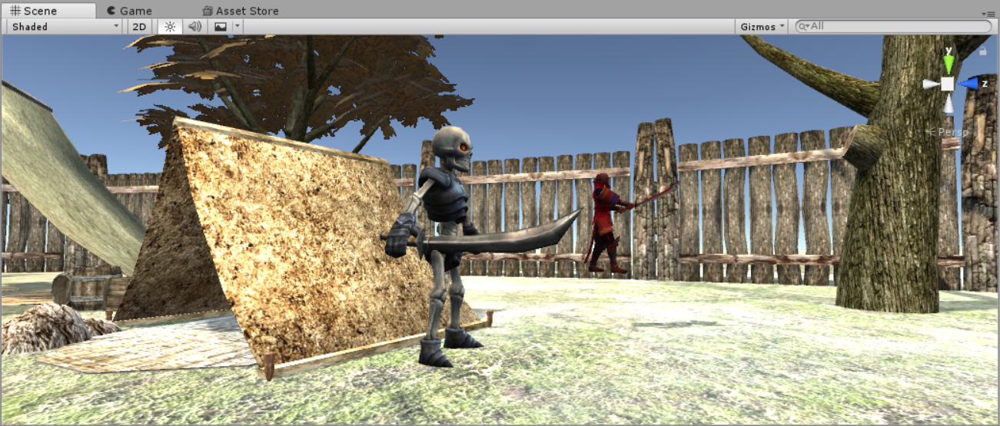
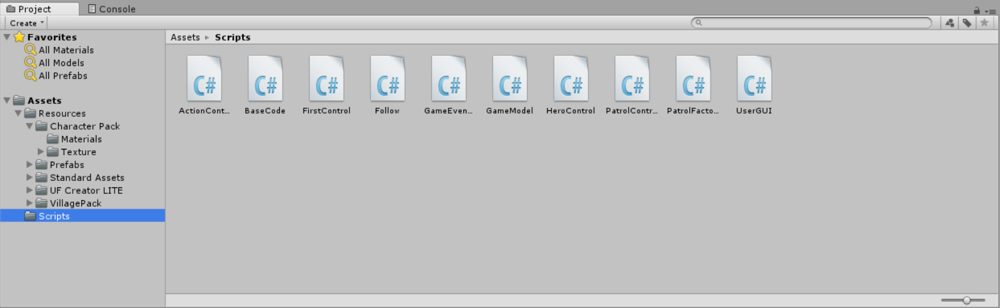
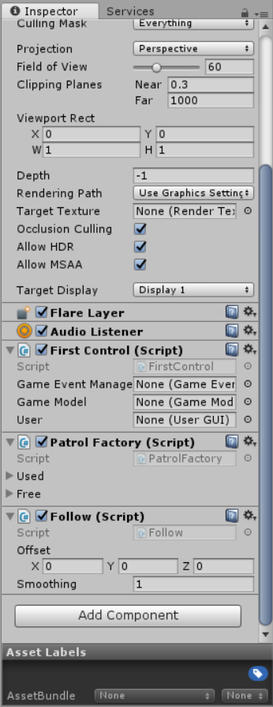
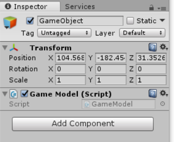
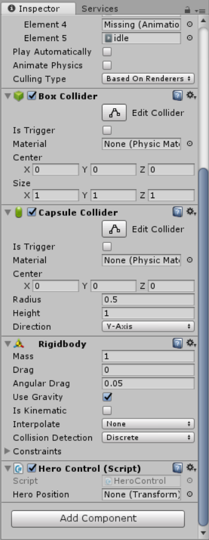
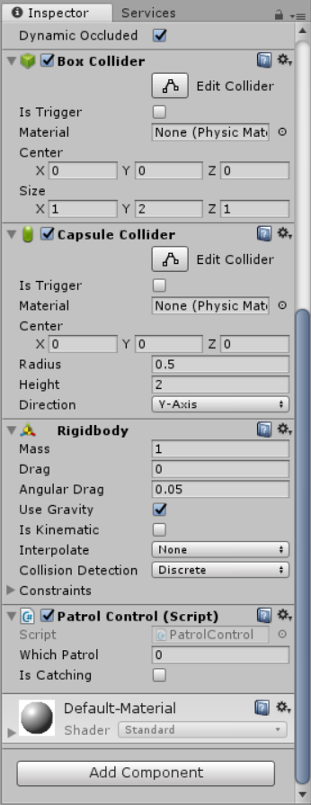
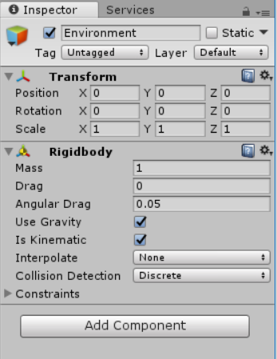

# 巡逻兵——MVC+工厂+订阅与发布模式
## 游戏简介
巡逻兵游戏是一款敏捷类游戏，我将游戏规则制定如下：
- 英雄：玩家
- 怪物：巡逻兵
- 当英雄出现在怪物一定范围内，怪物会开启追捕模式，即速度加快
- 每躲过一个巡逻兵的追捕，获得1分
- 当英雄没有进入怪物的搜寻范围时，怪物随机移动
- 被怪物追捕到即游戏结束
- 创新点：规则简单，游戏地形较复杂
## 设计模式
1. MVC模式
MVC模式在之前的有关牧师与魔鬼的博客中有详细解释过，这里沿用的是牧师与魔鬼的MVC框架，在此基础上做了一些改动，如果有兴趣可以到我的相关博客查看，这次主要解释下面两个模式。
2. 工厂模式
- 为什么需要工厂模式
游戏对象的创建与销毁成本较高，所以当游戏涉及大量游戏对象的创建与销毁时，必须考虑减少销毁次数，比如这次的打飞碟游戏，或者像其他类型的射击游戏，其中子弹或者中弹对象的创建与销毁是很频繁的。
- 工厂模式的定义
工厂模式是我们最常用的实例化对象模式了，是用工厂方法代替new操作的一种模式。这种类型的设计模式属于创建型模式，它提供了一种创建对象的最佳方式。
- 工厂模式的结构
游戏对象的创建与销毁，分别对应工厂里面的两个List，这两个List分别存放正在使用的游戏对象，已失效的游戏对象。同时保存两个List的目的是，减少游戏对象的创建与销毁的性能开销。如果已失效的List里面还有item，而这时工厂又需要完成一个新的“订单”，便可以从这些回收的item中拿出来再加工（一些逻辑处理），再返回给用户（调用方）。  
- 工厂模式的优缺点
    - 优点 
        - 一个调用者想创建一个对象，只要知道其名称就可以了。 - 扩展性高，如果想增加一个产品，只要扩展一个工厂类就可以。 
        - 屏蔽产品的具体实现，调用者只关心产品的接口。
        - 例子，如果一个客户需要一辆汽车，可以直接从工厂里面提货，而不用去管这辆汽车是怎么做出来的，以及这个汽车里面的具体实现。
    - 缺点
        - 一开始实现会比较复杂，需要用心设计一下工厂的结构
        - 每增加一个产品，可能都需要对工厂进行一次较大的“整改”
        - 如果工厂太大，实时保存的所有游戏对象的开销可能要大于游戏对象直接创建与销毁
- 工厂模式的意义（以上次打飞碟代码为例，我觉得上次的比较典型）
体现了面向对象设计的核心——抽象、包装、隐藏。道具工厂通过场景单实例，构建了可以被方便获取的disk类。包装了复杂的disk生产和回收逻辑，易于使用。包装了disk的产生规则，有利于应对未来游戏规则的变化，易于维护。
- 本次作业的工厂模式  
本次巡逻兵的项目作业，还是按照要求套用了工厂模式，但由于我的规则设置比较简单，在套用上次的工厂模式框架后其实发现没什么必要，因为我的巡逻兵数目是固定的，从头到尾就是6个，没有新增也没有销毁，当时有想过随着时间的增加而增加巡逻兵的数量以增加游戏难度，以及玩家攻击巡逻兵可以导致巡逻兵销毁。但在我的地形的基础上，6个巡逻兵其实刚好，少了太简单，多了又难到玩不下去，要说玩家可以攻击巡逻兵以达到控制巡逻兵数量的话，那每个巡逻兵都可以被攻击，玩家就没有逃跑的必要了。所以在用完工厂模式的时候，其实还是有点想删掉工厂模式的，但是想想如果后面需要对这次游戏规则做一些改变的话，工厂模式留着还是挺有用的。
3. 订阅与发布模式
- 为什么需要订阅与发布模式
就像我们订阅报刊，有什么时事新闻出现，报社（发布者）可以第一时间印刷数百份乃至数千份报纸（传播媒介），发到各个订阅了该报纸的人（订阅者）手上，这样就完成了信息传播。
- 订阅与发布模式的定义
在计算机编程中，订阅与发布模式与观察者模式比较容易混淆。用几张图来说明，他们之间主要的区别
    - 观察者模式的结构  
    在观察者模式中，观察者需要直接订阅目标事件；在目标发出内容改变的事件后，直接接收事件并作出响应  
    
    - 订阅与发布模式的结构  
    在发布订阅模式中，发布者和订阅者之间多了一个发布通道；一方面从发布者接收事件，另一方面向订阅者发布事件；订阅者需要从事件通道订阅事件。以此避免发布者和订阅者之间产生依赖关系。
    
    - 主要区别，直接和间接
    
- 本次的项目的应用  
当玩家得分或游戏结束时，都会GameEventManager的得分/游戏结束方法，但是具体怎么实现不用管。因为有可能后期需求更改，得分/游戏结束后需要实现更多效果。而此时我们只需要让这些效果订阅GameEventManager发布的得分/游戏结束信息，即可产生作用。实现功能的分类，降低代码耦合。

## 实现效果
- 基本地形

- 英雄模型

- 怪物模型


## 重要类实现，代码请直接在项目中查看
- 文件框架结构

    - ActionControl.cs，基础的动作管理类的集合，该文件里都是一些和动作管理有关的类。相当于动作的controller。
    - BaseCode.cs，一些最基本的类和接口的集合，如单实例导演类，控制场景的切换，IUserAction、回调接口等
    - FirstControl.cs，只包含FirstControl---控制第一个场景的类
    - GameEventManager.cs，只包含GameEventManager---发布者
    - UserGUI.cs，只包含UserGUI---订阅者兼用户界面管理器，比如显示分数、游戏状态以及监听键盘事件以控制角色的动画（走跑跳停等）
    - GameModel.cs，只包含GameModel---游戏模型，包括一些判定规则和运动规则
    - PatrolControl.cs，只包含PatrolControl---怪物（巡逻兵）的controller
    - HeroControl.cs，只包含HeroControl---英雄的controller
    - PatrolFactory.cs，只包含PatrolFactory---巡逻兵的制造工厂
    - Follow.cs，摄像机跟随人物移动的脚本
- 脚本挂载与组件添加情况  
    - camera
    
    - 空对象
    
    - 英雄
    
    - 巡逻兵
    
    - 地形
    
- 代码
    - ActionControl，这部分很长，但是基本套用模板，不需要改动太多，因此不放出来。
    - BaseCode.cs
    ```csharp
    using System.Collections;
    using System.Collections.Generic;
    using UnityEngine;

    namespace MyGame
    {
        public class Director : System.Object
        {
            private static Director _instance;
            public ISceneControl sceneCtrl { get; set; }

            public bool playing { get; set; } //

            public static Director getInstance()
            {
                if (_instance == null) return _instance = new Director();
                else return _instance;
            }

            public int getFPS()
            {
                return Application.targetFrameRate;
            }

            public void setFPS(int fps)
            {
                Application.targetFrameRate = fps;
            }
        }

        public class Singleton<T> : MonoBehaviour where T : MonoBehaviour
        {

            protected static T instance;
            public static T Instance
            {
                get
                {
                    if (instance == null)
                    {
                        //instance = new GameObject(typeof(T).Name).AddComponent<T>();
                        instance = (T)FindObjectOfType(typeof(T));
                        if (instance == null)
                        {
                            Debug.LogError("no scene instance");
                        }
                    }
                    return instance;
                }
            }
        }

        public interface ISSActionCallback
        {
            void ActionDone(SSAction source, bool catchState = false);
        }

        public interface ISceneControl
        {
            void LoadPrefabs();
        }

        public interface IUserAction
        {
            void heroMove(int dir);
            void Restart();
        }

        public class Diretion
        {
            public const int UP = 0;
            public const int DOWN = 2;
            public const int LEFT = -1;
            public const int RIGHT = 1;
        }

        public interface IAddAction
        {
            void addRandomMovement(GameObject sourceObj, bool isActive);
            void addDirectMovement(GameObject sourceObj);
        }

        public interface IGameStatusOp
        {
            Transform getHeroPosition();
            void heroEscapeAndScore();
            void patrolHitHeroAndGameover();
        }
    }
    ```
    - FirstControl
    ```csharp
    using System.Collections;
    using System.Collections.Generic;
    using UnityEngine;
    using UnityEngine.UI;
    using MyGame;
    using UnityEngine.SceneManagement;

    public class FirstControl : MonoBehaviour, ISceneControl, IGameStatusOp, IUserAction, IAddAction
    {
        //public ActionManager MyActionManager { get; set; }
        public GameEventManager gameEventManager;
        public GameModel gameModel;
        public PatrolFactory factory { get; set; }
        public UserGUI user;
        public static float time = 0;

        void Awake()
        {
            Director diretor = Director.getInstance();
            diretor.sceneCtrl = this;                              
        }

        // Use this for initialization
        void Start()
        {
            Begin();
        }

        public void LoadPrefabs()
        {
        }

        public void Begin()
        {
            LoadPrefabs();
            //MyActionManager = gameObject.AddComponent<ActionManager>() as ActionManager;        
            gameEventManager = gameObject.AddComponent<GameEventManager>() as GameEventManager;
            //gameModel = gameObject.AddComponent<GameModel>() as GameModel;
            Debug.Log("game model init");
            user = gameObject.AddComponent<UserGUI>();
            user.Begin();
        }

        public void Restart()
        {
            SceneManager.LoadScene("scene");
        }

        public void heroMove(int dir)
        {
            gameModel.heroMove(dir);
        }

        public void addRandomMovement(GameObject sourceObj, bool isActive)
        {
            gameModel.addRandomMovement(sourceObj, isActive);
        }

        public void addDirectMovement(GameObject sourceObj)
        {
            gameModel.addDirectMovement(sourceObj);
        }

        public Transform getHeroPosition()
        {
            return gameModel.getHeroPosition();
        }

        public void heroEscapeAndScore()
        {
            gameEventManager.heroEscapeAndScore();
        }

        public void patrolHitHeroAndGameover()
        {
            gameEventManager.patrolHitHeroAndGameover();
        }
    }
    ```
    - GameEventManager
    ```csharp
    using System.Collections;
    using System.Collections.Generic;
    using UnityEngine;
    using MyGame;

    public class GameEventManager : MonoBehaviour {
        public delegate void GameScoreAction();
        public static event GameScoreAction myGameScoreAction;

        public delegate void GameOverAction();
        public static event GameOverAction myGameOverAction;

        private FirstControl scene;

        void Start () {
            scene = (FirstControl)Director.getInstance().sceneCtrl;
            scene.gameEventManager = this;
        }        

        //hero escape, get score
        public void heroEscapeAndScore() {
            if (myGameScoreAction != null)
                myGameScoreAction();
        }

        //hero gets caught, game over
        public void patrolHitHeroAndGameover() {
            if (myGameOverAction != null)
                myGameOverAction();
        }
    }
    ```
    - UserGUI
    ```csharp
    using System.Collections;
    using System.Collections.Generic;
    using UnityEngine;
    using UnityEngine.UI;
    using MyGame;

    public class UserGUI : MonoBehaviour
    {
        private IUserAction action;
        GUIStyle LabelStyle1;
        GUIStyle LabelStyle2;
        GUIStyle ButtonStyle;
        public int score = 0;
        public static float time = 0;

        public int round = 1;
        public int CoolTimes = 3;
        public int game = 0; // status

        // Use this for initialization
        void Start()
        {
            action = (IUserAction)Director.getInstance().sceneCtrl;

            LabelStyle1 = new GUIStyle();
            LabelStyle1.fontSize = 20;
            LabelStyle1.alignment = TextAnchor.MiddleCenter;

            LabelStyle2 = new GUIStyle();
            LabelStyle2.fontSize = 30;
            LabelStyle2.alignment = TextAnchor.MiddleCenter;

            ButtonStyle = new GUIStyle("Button");
            ButtonStyle.fontSize = 20;
        }

        void Update()
        {
            //check key input and decide whether the hero should play animation
            GameObject hero = ((FirstControl)Director.getInstance().sceneCtrl).gameModel.getHero();        
            bool keyPressed = false;        
            if (Input.GetKey(KeyCode.UpArrow) || Input.GetKey(KeyCode.W))
            {
                hero.GetComponent<Animation>().Play("Run");
                keyPressed = true;
                action.heroMove(Diretion.UP);
            }
            if (Input.GetKey(KeyCode.DownArrow) || Input.GetKey(KeyCode.S))
            {
                hero.GetComponent<Animation>().Play("Run");
                keyPressed = true;
                action.heroMove(Diretion.DOWN);
            }
            if (Input.GetKey(KeyCode.LeftArrow) || Input.GetKey(KeyCode.A))
            {
                hero.GetComponent<Animation>().Play("Run");
                keyPressed = true;
                action.heroMove(Diretion.LEFT);
            }
            if (Input.GetKey(KeyCode.RightArrow) || Input.GetKey(KeyCode.D))
            {
                hero.GetComponent<Animation>().Play("Run");
                keyPressed = true;
                action.heroMove(Diretion.RIGHT);
            }
            if (Input.GetKey(KeyCode.J))
            {
                keyPressed = true;
                hero.GetComponent<Animation>().Play("Attack");
            }
            if (Input.GetKey(KeyCode.Space))
            {
                keyPressed = true;
                hero.GetComponent<Animation>().Play("Jump", PlayMode.StopAll);
            }
            if (keyPressed == false)
            {                    
                hero.GetComponent<Animation>().Play("idle");
            }

            //cool time system
            time += Time.deltaTime;
            if (time < 1)
                return;
            time = 0;

            if (game == 3)
            {
                if (CoolTimes > 1) CoolTimes--;
                else game = 0;
            }        
        }

        public void Restart()
        {
            CoolTimes = 3;
            game = 3;
            score = 0;
        }

        public void Begin()
        {
            Restart();
        }

        void OnGUI()
        {
            if (game == 0) // playing
            {
                GUI.Label(new Rect(Screen.width / 2, Screen.height / 2 - 160, 100, 50), "Score: " + score, LabelStyle1);
            }
            else if (game == 1) // game over
            {
                GUI.Label(new Rect(Screen.width / 2 - 50, Screen.height / 2 - 85, 100, 50), "Gameover!", LabelStyle2);
                if (GUI.Button(new Rect(Screen.width / 2 - 70, Screen.height / 2, 140, 70), "Restart", ButtonStyle))
                {
                    game = 0;
                    action.Restart();
                }
            }
            else if (game == 2) // win
            {
                GUI.Label(new Rect(Screen.width / 2 - 50, Screen.height / 2 - 85, 100, 50), "You win!", LabelStyle2);
                if (GUI.Button(new Rect(Screen.width / 2 - 70, Screen.height / 2, 140, 70), "Restart", ButtonStyle))
                {
                    game = 0;
                    action.Restart();
                }
            }
            else if (game == 3) // ready
            {
                GUI.Label(new Rect(Screen.width / 2 - 30, Screen.height / 2, 100, 50), CoolTimes.ToString(), LabelStyle2);
            }
        }

        void OnEnable()
        {
            GameEventManager.myGameScoreAction += getScore;
            GameEventManager.myGameOverAction += gameOver;
        }

        void OnDisable()
        {
            GameEventManager.myGameScoreAction -= getScore;
            GameEventManager.myGameOverAction -= gameOver;
        }

        void getScore()
        {
            score++;
        }

        void gameOver()
        {
            game = 1;
        }
    }
    ```
    - PatrolControl
    ```csharp
    using System.Collections;
    using System.Collections.Generic;
    using UnityEngine;
    using MyGame;

    public class PatrolControl : MonoBehaviour {
        private IAddAction addAction;
        private IGameStatusOp gameStatusOp;

        public int whichPatrol;
        public bool isCatching; //whether found hero

        private float CATCH_RADIUS = 3.0f;

        // Use this for initialization
        void Start () {
            addAction = (FirstControl)Director.getInstance().sceneCtrl as IAddAction;
            gameStatusOp = (FirstControl)Director.getInstance().sceneCtrl as IGameStatusOp;

            whichPatrol = getIndex();
            isCatching = false;
        }

        // Update is called once per frame
        void Update () {
            //check
            if (Vector3.Distance(gameStatusOp.getHeroPosition().position, gameObject.transform.position) <= 20f)
            {   
                //hero go in the area
                //start catching
                if (!isCatching)
                {
                    Debug.Log(this.gameObject + " is catching");
                    isCatching = true;                
                }
                //moves direct to the hero
                addAction.addDirectMovement(this.gameObject);
            }
            else
            {
                if (isCatching)
                {
                    Debug.Log(this.gameObject + " stops catching");
                    //hero has moved out of the area
                    //stop catching 
                    gameStatusOp.heroEscapeAndScore();
                    isCatching = false;                
                }
                //then moves randomly
                addAction.addRandomMovement(this.gameObject, false);
            }
        }

        public int getIndex()
        {
            //get the index of patrol
            string name = this.gameObject.name;
            return name[name.Length - 1] - '0';
        }

        void OnCollisionStay(Collision e)
        {
            //hit other patrol, move to other direction
            if (e.gameObject.name.Contains("Patrol"))
            {
                isCatching = false;
                addAction.addRandomMovement(this.gameObject, false);
            }

            //hit hero, game over
            if (e.gameObject.name.Contains("hero"))
            {
                gameStatusOp.patrolHitHeroAndGameover();
                Debug.Log("Game Over!");
            }
        }
    }
    ```
    - Follow
    ```csharp
    using System.Collections;
    using System.Collections.Generic;
    using UnityEngine;
    using MyGame;

    public class Follow : MonoBehaviour
    {
        public Vector3 offset;
        private Transform playerBip;
        public float smoothing = 0.5f;

        // Use this for initialization
        void Start()
        {
            playerBip = GameObject.Find("hero").transform;
            offset = transform.position - playerBip.position;
        }

        // Update is called once per frame
        void FixedUpdate()
        {
            //transform.position = playerBip.position + offset;
            Vector3 targetPos = playerBip.position + offset;
            transform.position = Vector3.Lerp(transform.position, targetPos, smoothing * Time.deltaTime);
        }
    }
    ```
---
## 其他
- 以上多数为个人理解，可能有误，仅供参考。
- 本次项目觉得做得最好的模式是MVC，在之前几次的基础上渐渐改进，本次项目分离得比较彻底，耦合度低了许多。
- 如感兴趣，可访问笔者Gayhub博客地址---[传送门](https://gitgiter.github.io/2018/05/11/Unity3d-hw6-%E5%B7%A1%E9%80%BB%E5%85%B5/)
- 视频演示地址---[传送门](https://www.bilibili.com/video/av23309694/)
- csdn博客地址---[传送门](https://mp.csdn.net/mdeditor/80288017)
---