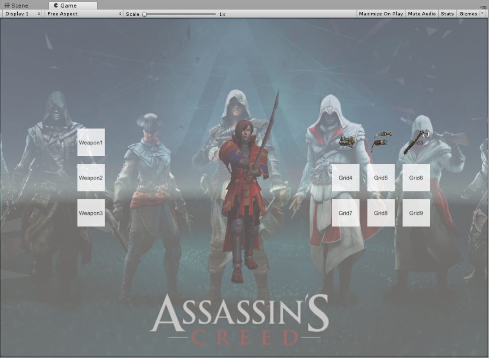
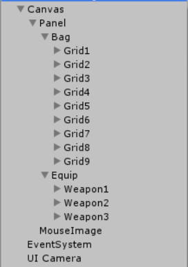
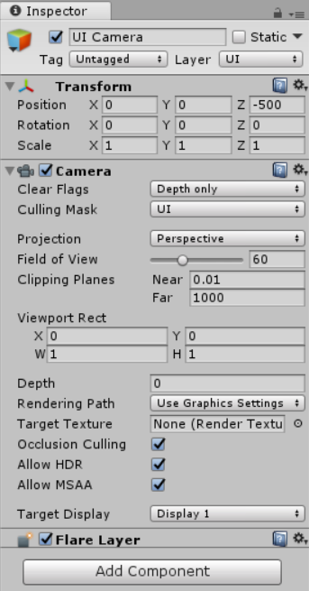
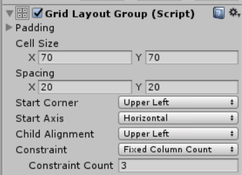
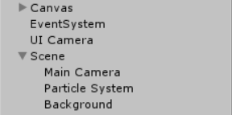
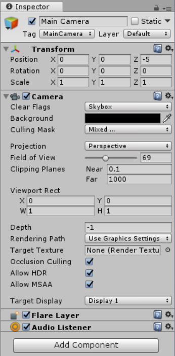
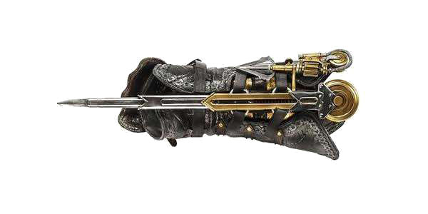
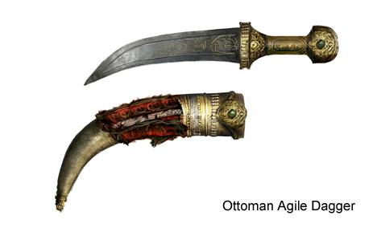
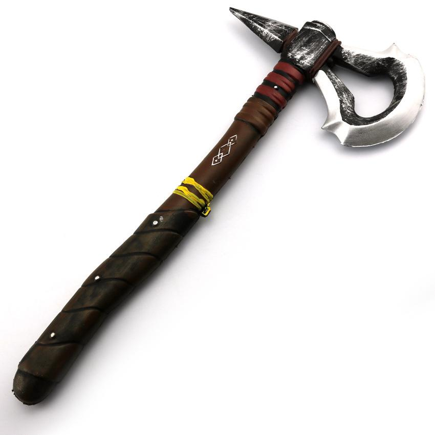
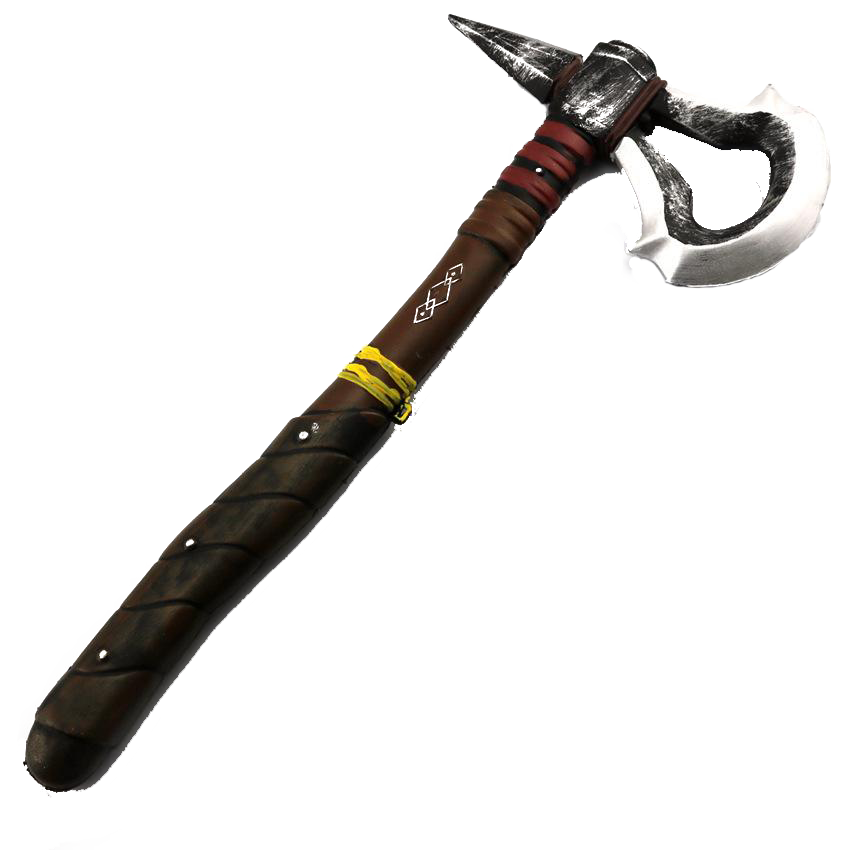

# Unity3d实战之粒子系统
## 选题要求
参考unity官网的背包系统例子，实现一个简单的背包系统

## 实现效果
- 静态图

- 动态图


## 知识准备
- 摄像机渲染
    - Clearing Flags：
        - Skybox：天空盒(默认项)。在屏幕空白处显示当前摄像机的天空盒，如果没有指定天空盒，则会显示默认背景色。
        - Solid Color：空白处将显示默认此处设置的背景色。
        - Depth only：仅深度，该模式用于对象不被裁剪。
        - Don't Clear：不清除，该模式不清楚任何颜色和或深度缓存，但这样做每帧渲染的结果都会叠加在下一帧之上。
    - Culling Mask： 摄像机渲染的层
    - Layers： 摄像机所在的层
    - Depth： 指定多个摄像机的渲染顺序
    - Rendering Path：渲染路径，设定摄像机的渲染方法
    - Projection：投影方式，分为透视和正交
    - Clipping Planes：剪裁平面，摄像机的渲染范围。Near为最近的点，Far为最远的点
- 粒子系统
    粒子系统有许多大模块，比如最常用的有初始化模块、发射模块、粒子群形状模块，颜色随存活时间、速度变化的模块等。方便起见这里再把上次的粒子系统贴一遍。
    |参数|功能|
    |:---:|:---:|
    |持续时间（Duration）|粒子系统发射粒子的持续时间|
    |循环（Looping）|粒子系统是否循环|
    |预热（Prewarm）|当looping开启时，才能启动预热（Prewarm），游戏开始时粒子已经发射了一个周期|
    |初始延迟（Start Delay）|粒子系统发射粒子之前的延迟。注意在prewarm（预热）启用下不能使用此项|
    |初始生命（Start Lifetime）|以秒为单位，粒子存活数量|
    |初始速度（Start Speed）|粒子发射时的速度|
    |初始大小（Start Size）|粒子发射时的大小|
    |初始旋转（Start Rotation）|粒子发射时的旋转值|
    |初始颜色（Start Color）|粒子发射时的颜色|
    |重力修改器（Gravity Modifier）|粒子在发射时受到的重力影响|
    |继承速度（Inherit Velocity）|控制粒子速率的因素将继承自粒子系统的移动（对于移动中的粒子系统）|
    |模拟空间（Simulation Space）|粒子系统在自身坐标系还是世界坐标系|
    |唤醒时播放（Play On Awake）|如果启用粒子系统当在创建时，自动开始播放|
    |最大粒子数（Max Particles）|粒子发射的最大数量|

## 实现步骤
- 第一步，搭建UI界面。新建一个画布（Canvas），再创建一个Panel容器，里面包含UI界面的所有UI控件，比如背包区的九个格子和装备区的三个格子，每个格子都是一个Button控件，背包区和装备区的这些按钮的父级分别是Bag和Equip两个空对象，主要是为了添加GridLayout控件来控制子对象的布局，以及相应的控制脚本。基本的控件创建好之后，将画布设置成UI层，接着再创建一个保存鼠标图片的Image控件，这是为了暂存移动的图片达到交换目的，最后创建一个专门渲染UI层的摄像机，将其Culling Mask设置成UI层。这样UI层的搭建基本完成，剩下的就是对控件位置、大小等的参数调整，以及更改控件的图片。这里要注意的一点是，**添加图片时必须先把原来的图片转成Sprite类型才可以被Image组件识别**。  
搭建完成后的文件结构
  
UI Camera设置
  
GridLayout组件的设置

- 第二步，搭建背景界面。这个比布置UI界面容易多了。为了让背景有点简单的动态特效，这里用到了一点粒子系统。首先新建一个空对象scene，然后右键scene->Effects->Particle System，便可把例子系统添加为其子对象。接着再新建一个空对象，用来显示背景图片，修改其Sprite Renderer的Sprite为要添加的背景图片即可。最后把主摄像机放到这个空对象下面，其渲染的层是默认层，无需修改。要注意的是必须确保UI层的渲染要介于背景层渲染和英雄层渲染之间，用摄像机的深度Depth控制。  
搭建完成后的文件结构

主摄像机设置

- 第三步，搭建英雄层。这层就是用来渲染英雄的，为了和UI层区分开来以便拓展更多的功能。新建一个摄像机，负责渲染英雄层，将英雄作为该摄像机的子对象，并将英雄的所在层设置成英雄层（自定义的一个层）。  
搭建完成后的总的文件结构

英雄摄像机的设置

- 第四步，实现画布随鼠标旋转。这里用的是老师上课提供的一个源码，我外加做了一些修改，原本是整个画布的旋转，但是感觉看起来怪怪的，我将其改成以中轴线为界，两边（背包区和装备区）分别旋转，鼠标在背包区的时候装备区不动，鼠标在装备区的时候背包区不动。因此便有了两份类似的代码，分别挂载在背包区的父级元素Bag上和装备区的父级元素Equip上。  
以控制背包区随鼠标旋转的代码为例
```csharp
public class BagTilt : MonoBehaviour {

    public Vector2 range = new Vector2(50f, 30f);

    Transform mTrans;
    Quaternion mStart;
    Vector2 mRot = Vector2.zero;

    // Use this for initialization
    void Start()
    {
        mTrans = transform;
        mStart = mTrans.localRotation;
    }

    // Update is called once per frame
    void Update()
    {
        Vector3 pos = Input.mousePosition;
        //Debug.Log(pos);        

        float halfWidth = Screen.width * 0.5f;
        float halfHeight = Screen.height * 0.5f;

        if (pos.x - halfWidth < 0) return;

        float x = Mathf.Clamp((pos.x - halfWidth) / halfWidth, -1f, 1f);
        float y = Mathf.Clamp((pos.y - halfHeight) / halfHeight, -1f, 1f);
        mRot = Vector2.Lerp(mRot, new Vector2(x, y), Time.deltaTime * 5f);

        mTrans.localRotation = mStart * Quaternion.Euler(-mRot.y * range.y, -mRot.x * range.x, 0f);
    }
}
```
- 第五步，实现游戏的管理者。挂载到任何一个对象上都行，因为其执行与所挂在的对象无关，是对整个游戏场景的控制。这里我是挂载到Canvas上。游戏的管理者主要负责跟踪装备区的装备情况、装备类型的判断以及鼠标对象的单例化。这里为了方便添加脚本，在构造函数中采用循环为每个Button添加对应的脚本。
```csharp
public class Manager : MonoBehaviour {

    private MouseImage mouse;
    private int IsWeapon1 = 0;
    private int IsWeapon2 = 0;
    private int IsWeapon3 = 0;

    // Use this for initialization
    void Start()
    {
        mouse = (MouseImage)FindObjectOfType(typeof(MouseImage));
        for (int i = 1; i <= 9; i++)
        {
            GameObject.Find("Grid" + i).AddComponent<Bag>();
        }
        for (int i = 1; i <= 3; i++)
        {
            GameObject.Find("Weapon" + i).AddComponent<Equip>();
        }
    }

    // Update is called once per frame
    public MouseImage getMouse()
    {
        return mouse;
    }

    public void setMouse(MouseImage m)
    {
        if (mouse == null)
        {
            mouse = m;
        }
    }

    public int getWeapon1()
    {
        return IsWeapon1;
    }
    public int getWeapon2()
    {
        return IsWeapon2;
    }
    public int getWeapon3()
    {
        return IsWeapon3;
    }
    public void setWeapon1(int w1)
    {
        IsWeapon1 = w1;
    }
    public void setWeapon2(int w2)
    {
        IsWeapon2 = w2;
    }
    public void setWeapon3(int w3)
    {
        IsWeapon3 = w3;
    }
}
```
- 第六步，实现对鼠标对象的维护。新建一个C#脚本MouseImage，挂载在MouseImage这个Image对象上。目的也就是，使得点击装备区或是背包区的时候，如果点击的格子里面有装备，则和鼠标上的图片发生交换，以达到将装备取出的效果，而且实现点击图片，图片跟随鼠标移动的效果。这个脚本主要负责装备类型的检测、鼠标图片的设置和图片跟随鼠标移动。Update部分鼠标坐标减去的值是为了不让鼠标上的图片阻挡了对按钮的点击。
```csharp
public class MouseImage : MonoBehaviour {

    private Manager GM;
    private Image mouseImage;
    private int mouseType = 0;
    private int z;

    public Sprite none;
    public Sprite weapon1;
    public Sprite weapon2;
    public Sprite weapon3;

    // Use this for initialization
    void Start()
    {
        GM = (Manager)FindObjectOfType(typeof(Manager));
        GM.setMouse(this);
        mouseImage = GetComponent<Image>();        
        z = -400;

        weapon1 = GameObject.Find("Grid1").GetComponent<Image>().sprite;
        weapon2 = GameObject.Find("Grid2").GetComponent<Image>().sprite;
        weapon3 = GameObject.Find("Grid3").GetComponent<Image>().sprite;
        none = GameObject.Find("MouseImage").GetComponent<Image>().sprite;
    }

    public int getMouseType()
    {
        return mouseType;
    }
    public void setMouseType(int m)
    {
        mouseType = m;
        switch (m)
        {
            case 0:
                mouseImage.sprite = none;
                z = -400;
                break;
            case 1:
                mouseImage.sprite = weapon1;
                z = 100;
                break;
            case 2:
                mouseImage.sprite = weapon2;
                z = 100;
                break;
            case 3:
                mouseImage.sprite = weapon3;
                z = 100;
                break;
            default:
                mouseImage.sprite = none;
                z = -400;
                break;
        }        
    }

    // Update is called once per frame
    void Update()
    {
        transform.position = new Vector3(Input.mousePosition.x - 26, Input.mousePosition.y - 26, z);
    }
}
```
- 第七步，实现背包区的交换逻辑。这里主要是要赋予背包区按钮对点击事件的响应能力。比如做一些基本的判断：不管鼠标图片是否为空，如果点中有装备的格子，那么将发生交换，交换的时候要记录装备类型，其他情况一律不交换。为了避免重复添加的繁琐，我是直接在代码里面绑定点击事件，这样也便于修改。
```csharp
public class Bag : MonoBehaviour {

    private Manager GM;
    private Image gridImage;
    private int mouseType = 0;

    public Sprite none;
    public Sprite weapon1;
    public Sprite weapon2;
    public Sprite weapon3;

    // Use this for initialization
    void Start () {
        GM = (Manager)FindObjectOfType(typeof(Manager));
        gridImage = GetComponent<Image>();
        weapon1 = GameObject.Find("Grid1").GetComponent<Image>().sprite;
        weapon2 = GameObject.Find("Grid2").GetComponent<Image>().sprite;
        weapon3 = GameObject.Find("Grid3").GetComponent<Image>().sprite;
        none = GameObject.Find("Grid4").GetComponent<Image>().sprite;
        Debug.Log(gridImage.sprite == weapon1);
        Debug.Log(weapon1);
        Debug.Log(weapon2);
        Debug.Log(weapon3);
        this.GetComponent<Button>().onClick.AddListener(OnBagButton);
    }
	
	// Update is called once per frame
	void Update () {
		
	}

    public void OnBagButton()
    {
        //Debug.Log("grid click");
        mouseType = GM.getMouse().getMouseType();
        if (gridImage.sprite == none && mouseType != 0)
        {
            switch (mouseType)
            {
                case 1:
                    gridImage.sprite = weapon1;
                    break;
                case 2:
                    gridImage.sprite = weapon2;
                    break;
                case 3:
                    gridImage.sprite = weapon3;
                    break;
                default:
                    gridImage.sprite = none;
                    break;
            }
            GM.getMouse().setMouseType(0);          
        }
        else
        {
            //Debug.Log(gridImage.sprite);
            //Debug.Log(mouseType);
            if (gridImage.sprite == none)
            {
                GM.getMouse().setMouseType(0);
            }
            else if (gridImage.sprite == weapon1)
            {
                GM.getMouse().setMouseType(1);
            }
            else if (gridImage.sprite == weapon2)
            {
                GM.getMouse().setMouseType(2);
            }
            else if (gridImage.sprite == weapon3)
            {
                GM.getMouse().setMouseType(3);
            }

            switch (mouseType)
            {
                case 0:                    
                    gridImage.sprite = none;
                    break;
                case 1:
                    gridImage.sprite = weapon1;
                    break;
                case 2:
                    gridImage.sprite = weapon2;
                    break;
                case 3:
                    gridImage.sprite = weapon3;
                    break;
                default:
                    gridImage.sprite = none;
                    break;
            }                 
        }
    }
}
```
- 第八步，实现装备区的交换逻辑。这里同样是要赋予装备区按钮对点击事件的响应能力。比如稍有不同的简单判断：类似在背包区交换的原理和基础上，外加检测交换的装备类型是否符合该格子所应装备的类型，如果符合才允许交换。同样的，也是在代码里面绑定点击事件。这里我为了弥补添加装备时没有动画的遗憾，规定每次添加动作时英雄都播放一次攻击动画，播放完成后回到Idle状态。
```csharp
public class Equip : MonoBehaviour {

    private Manager GM;
    private Image weaponImage;
    private GameObject hero;
    public int mouseType;
    public Sprite weapon1;
    public Sprite weapon2;
    public Sprite weapon3;
    public Sprite none;

    // Use this for initialization
    void Start () {
        GM = (Manager)FindObjectOfType(typeof(Manager));
        weaponImage = GetComponent<Image>();
        hero = GameObject.Find("Hero");
        weapon1 = GameObject.Find("Grid1").GetComponent<Image>().sprite;
        weapon2 = GameObject.Find("Grid2").GetComponent<Image>().sprite;
        weapon3 = GameObject.Find("Grid3").GetComponent<Image>().sprite;
        none = GameObject.Find("Grid4").GetComponent<Image>().sprite;
        Debug.Log(weapon1);
        Debug.Log(weapon2);
        Debug.Log(weapon3);
        Debug.Log(none);
        this.GetComponent<Button>().onClick.AddListener(OnEquipButton);
        mouseType = this.name[this.name.Length - 1] - '0';
        Debug.Log(mouseType);
    }
	
	// Update is called once per frame
	void Update () {
        if (hero.GetComponent<Animation>().IsPlaying("Attack") == false)
        {
            hero.GetComponent<Animation>().Play("idle", PlayMode.StopAll);
        }
        if (mouseType == 1 && GM.getWeapon1() == 1)
        {
            GM.setWeapon1(0);
            weaponImage.sprite = weapon1;
        }
        else if (mouseType == 2 && GM.getWeapon2() == 1)
        {
            GM.setWeapon2(0);
            weaponImage.sprite = weapon2;
        }
        else if (mouseType == 3 && GM.getWeapon3() == 1)
        {
            GM.setWeapon3(0);
            weaponImage.sprite = weapon3;
        }
    }

    public void OnEquipButton()
    {
        //Debug.Log("equiping");
        int _mouseType = GM.getMouse().getMouseType();
        Debug.Log(_mouseType);
        if (weaponImage.sprite != null && _mouseType == 0)
        {
            weaponImage.sprite = none;
            GM.getMouse().setMouseType(mouseType);
        }
        else if (weaponImage.sprite == none && _mouseType == mouseType)
        {
            switch (_mouseType)
            {
                case 0:
                    weaponImage.sprite = none;
                    break;
                case 1:
                    GM.setWeapon1(1);
                    weaponImage.sprite = weapon1;
                    break;
                case 2:
                    GM.setWeapon2(1);
                    weaponImage.sprite = weapon2;
                    break;
                case 3:
                    GM.setWeapon3(1);
                    weaponImage.sprite = weapon3;
                    break;
                default:
                    weaponImage.sprite = none;
                    break;
            }
            GM.getMouse().setMouseType(0);
            Animation animation = hero.GetComponent<Animation>();
            animation.Play("Attack", PlayMode.StopAll);
            animation.wrapMode = WrapMode.Once;
        }        
    }
}
```
- 第九步，图片加工。在网上进行了一番搜索和筛选之后，选到比较符合心意的图，但是都是白底不透明的，放在界面上感觉很生硬。为了更加逼真地模仿，我用了ps对筛选好的图片进行了简单的抠图处理，使得每个装备除装备实体以外的部分都是透明的，同样美观起见，将没有装备时的鼠标图片也设置成一张全透明的图片。  
效果对比（深色背景下才看得出差别）：  

|武器|袖箭|匕首|斧子|
|:---:|:---:|:---:|:---:|
|处理前||||
|处理后||||

- 第十步，初始化所有粒子。这里主要随机产生一些粒子的信息，比如粒子半径，角度，大小等。
```csharp
void IniAll()
{                
    for (int i = 0; i < count; ++i)
    {   
        // 随机每个粒子半径，集中于平均半径附近  
        float midRadius = 8.0f;
        float radius = Random.Range(midRadius - 2, midRadius + 2);

        // 随机每个粒子的角度  
        float angle = Random.Range(0, 360);
        // 转换成弧度制
        float radian = angle / 180 * Mathf.PI;

        // 随机每个粒子的大小
        float size = Random.Range(0.01f, 0.03f);

        info[i] = new ParticleInfo(radius, angle);            

        particleArr[i].position = new Vector3(info[i].radius * Mathf.Cos(radian), 0f, info[i].radius * Mathf.Sin(radian));
        particleArr[i].size = size;            
    }
    // 通过初始化好的粒子数组设置粒子系统
    particleSys.SetParticles(particleArr, particleArr.Length);
}
```
- 最后一步。核对所有代码挂载情况、文件结构以及摄像机的渲染情况，耐心慢慢调参。调好合适的位置后变可以正常的运行了。到此便和一开始展示的效果完全一致了。


---
## 其他
- 以上为个人理解，可能有误，仅供参考。
- 如感兴趣，可访问笔者Gayhub博客地址---[传送门](https://gitgiter.github.io)
- 视频演示地址---[传送门](https://www.bilibili.com/video/av24424927/)
- csdn博客地址---[传送门](https://blog.csdn.net/Wonderful_sky/article/details/80589009)
---