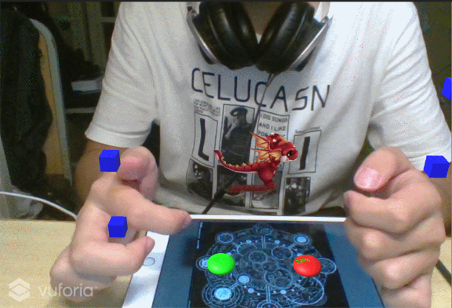

## AR模型识别
### 配置步骤  
这里网上教程很多，就不详细阐述了，大致过程就是去高通（vuforia）官网注册一个账号同意相关协议，下载sdk并导入。然后创建一个app关联数据库，数据库中上传待识别的图像，然后等vuforia分析完识别图的特征点之后，将target作为一个unity editor的选项下载下来后也导入unity项目。最后是项目内的配置，需要配置根据之前创建app时密钥配置unity项目，然后将预制ImageTarget的目标设置成你要识别的图片。运行项目时将待识别的图片放置在电脑摄像头范围内即可。
### 注意点
- 图像的星级  
我们会注意到将识别图上传到数据库时，target项右侧会有星级显示，星级越高代表识别图的质量越高。你可能会问，何为识别图质量？识别图质量有什么用？答案是，你踩过坑之后就知道了。经试验，影响识别图最主要的因素就是待识别图的对比度，这里应该要极力避免使用有很多连续相同或相似大色块的图片，因为分析识别图特征点的原理是 **根据色块边缘** 来决定的，色彩变化越丰富，色块边缘、棱角就越多（如果棱角分布均匀且每个色块都很小那就再好不过了），进而特征点就越多，而特征点越多就意味着识别图质量越高。另外，以下三点则是我总结的识别图质量最主要影响的三个方面：
    - 星级越高越容易识别
    - 星级越高识别速度越快
    - 星级越高更不容易出现抖动
- **模型的抖动问题（比较棘手）**  
识别出来的模型抖动问题一直是AR图像识别中存在的难题，这一定程度上和识别算法有关，很多识别工具也还没有做得很完善。因此我们能做的就是采取一些比较初级的措施来尽可能地避免模型抖动，高级的方法当然还有待研究。初级的方法我们就是要大致了解图像识别的原理，换句话说，就是尽可能地让图像容易识别和模型容易被渲染。我的话虽然识别图是五星的，但是一开始使用了一个比较复杂的模型，导致渲染模型时抖动比较剧烈，网上找了好多有关防抖动的原因，总结起来切入点主要有以下几个（一般推荐前两个）：
    - 提高识别图的星级，尽量使用容易识别的图（前面已经提到过）
    - 使用更简单的模型，减少模型的面数，会使降低渲染难度
    - 烘培场景，调整灯光。因为现场实时识别最大的问题就是光线和角度的不稳定或不恰当，导致模型会不停抖动。
    - 优化识别算法（不在我们考虑范围内）

- **虚拟按钮的检测（尤其注意）**  
虚拟按钮第一次接触的话，听起来是个很神奇的东西。因此感觉用虚拟按钮做什么都很有意思。但是这里有个很大的坑，就是 **虚拟按钮必须在识别图范围内，否则无论怎么点都点不到！！！** 一开始没有注意到，还以为是点击方式的问题，盲目实现导致花费了很多时间到头来发现实现不了，可以说这次项目基本时间都花在这个坑里了，因此最后也就只好交了一个比较简单的版本，这是由于没有弄清楚虚拟按钮的原理导致的。在网上搜了很多技术博客以及逛了许多技术论坛，有关的博客少之又少，因为往年没有布置过AR的作业，所以也没有师兄博客可以参考，总之就是几乎没有发现有人提过类似的问题，于是就不得已只好将目光投向虚拟按钮的实现原理。虚拟按钮的触发原理是，**根据识别图被遮挡的特征点所在的位置来判断是否点击了按钮**。为什么叫遮挡，遮挡了什么？这时才反应过来是虚拟按钮的点击是通过检测识别图的对应位置是否被遮挡了，所以按钮一定要在识别图范围内，更准确地说，是在特征点分布的范围内。这样就又带来一个问题，如何使在遮挡虚拟按钮时不要让识别目标丢失。因为一开始我用的识别图虽然是五星的，但特征点整体集中在中间区域，也就是我的图有很多留白，总体来说特征点太集中，遮挡一部分时虚拟按钮都还没响应就失去目标了，这是我遇到的又一个问题，至此才真正发现问题所在（当时以为把虚拟按钮放在识别图范围内了还没有效果，一度以为是触发方式的问题）。于是我就将识别图换成了一幅特征点分布比较均匀的图，并且将待识别图载体由原来用手机换成了平板（面积更大），或许还可以将待识别图打印到一张A4的彩印纸上。

---

## 地图的动态维护
### 地图结构  
分为好多间隔相同的列，每列有三个障碍物位置，不能全放满（要留条活路），因此允许放0~2个障碍物，这些位置的障碍物都是随机生成的。

### 地图初始化（生成）  
一开始初始化足够多的列，这里我是选择初始化5列，只要能保证移动的时候能衔接自然即可。然后针对每列的随机算法是，对每列的三个位置，随机不重复地挑选至多两个位置，然后在该位置上，随机决定该位置是否应该有障碍物。这样就可以完全使地图随机生成了。

### 地图维护  
为了减少运行开销，对于移出视野的地图，应该进行销毁。另外，为了生成无尽的地图，应该也要在移动过程中动态生成新的地图拼接在原地图后面。这里我是采用一个队列来维护整个地图以及实现地图的移动，因为队列是不允许直接遍历的，所以我的遍历是将队列头部元素重新插入到队尾来遍历。

---

- 效果  
    - 静态图  
    
    - 动态图
    
- 视频  
[https://www.bilibili.com/video/av25227554/](https://www.bilibili.com/video/av25227554/)
- Github博客  [https://gitgiter.github.io/2018/06/19/Unity3d-hw9-AR%E5%B0%8F%E6%B8%B8%E6%88%8F/](https://gitgiter.github.io/2018/06/19/Unity3d-hw9-AR%E5%B0%8F%E6%B8%B8%E6%88%8F/)
- CSDN博客  
[https://blog.csdn.net/Wonderful_sky/article/details/80744334](https://blog.csdn.net/Wonderful_sky/article/details/80744334)